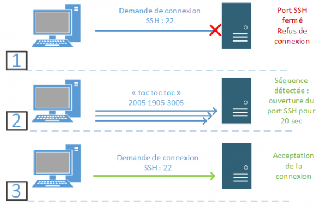

# Port Knocking 

 Le port knocking est une méthode permettant  d’ouvrir et de fermer les ports d’une machine de façon dynamique.

L'un de principaux dangers lors de la mise en place d'accés ssh sur un serveur c'est qu'un intrus le repere (via un Scan de port ou un scan de réseau ) et y tente d'y accéder par divers méthodes.

Le principe du port knocking est de faire croire que le port est fermé et donc de faire croire qu'il n'y a pas de service SSH sur le serveur.
Le port ne s'ouvrira uniquement lorsqu'il aura reçu une séquence bien précise de signaux sur des ports définis à l'avance 

Lorsqu'un port a été ouvert par la séquence correcte, les règles du pare-feu n'autorisent que l'adresse IP ayant lancé la séquence à communiquer sur le port ouvert. Le port peut de nouveau être fermé après un délai prévu ou à la demande.

Par exemple si on détérmine que le serveur ouvrira le port SSH sur une durée de 20 secondes seulement lorsqu'on enverra un signal sur les ports 2009 1906 3244 du serveur. Ensuite le port SSH une fois les 20 secondes écoulés se fermera automatiquement en gardant uniquement la connexion établie lors du laps de temps d'ouverture du port. 

La seule indication d'échec est de ne pas avoir de port nouvellement ouvert à la fin de la séquence. A aucun moment des informations sont envoyé à la personne qui à lancé une séquence erroné,  le système reste muet.

La méthode de port-knocking est considérée comme sécurisée étant données qu'elle est située à un niveau bas des couches TCP/IP et qu'elle ne  requière pas de port ouvert (le service knockd est lui aussi invisible). 
cependant elle n'est pas infaillible.

