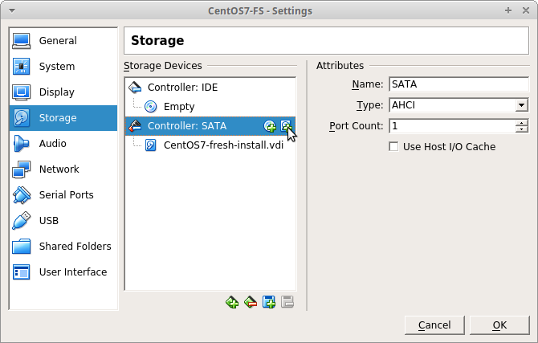
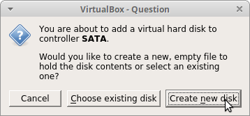
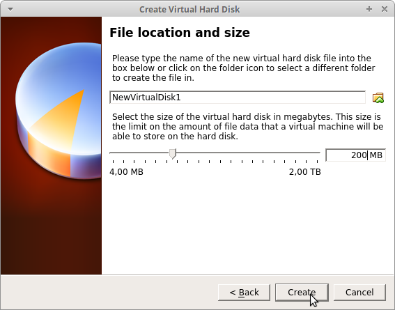
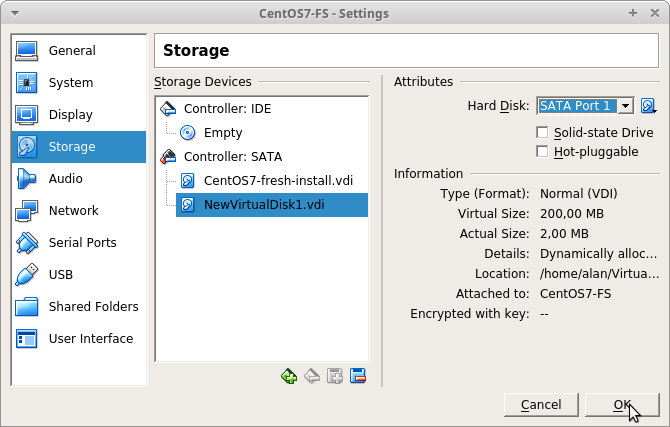

# TD filesystème

## Gestion des partitions

### Ajoutez un disque

à partir d'un VM fraichement installé (un clone) **avant de la démarrer** editez la VM et ajouter un nouveau disque de 200MB





au format VDI et en allocation dynamique



> Vérifiez bien que le nouveau disque est sur un numéro de port supérieur au disque système afin d'éviter qu'il soit considéré en premier dique au boot



ici c'est le port SATA 1

### Création d'une partition

Demarrez la VM et vérifier que le disque est bien détecté par le kernel

```bash
[root@localhost ~]$ dmesg | grep disk
[    0.638243] systemd[1]: Running in initial RAM disk.
[    3.109888] sd 3:0:0:0: [sdb] Attached SCSI disk
[    3.109943] sd 2:0:0:0: [sda] Attached SCSI disk
```

La commande dmesg pour Daily message affiche les log du kernel

#### gestion de la table de partition

Avec les outils fdisk et parted créez, supprimer et recréez une table de partition de type dos ou msdos et une partition qui occupe tout l'espace du nouveau disque de type linux (code exadécimal 83).

* `fdisk -l` et `parted -l` vous permet de **repèrer le disque de 210MB** (oui on a mis 200 mais Virtual box à donner 210) dans mon cas c'est le disque /dev/sdb
* Puis `fdisk /dev/sdb` et `parted /dev/sdb` **dans mon cas** permet d'éditer la table de partition
  Suivez les menu et pensez bien à spécifier le type de partition ou de filesystem
* Enfin dmesg vous permet de constater que la nouvelle partition à été détecté par le kernel

  ```bash
  [root@localhost ~]$ dmesg  | tail -2
  [  647.140677]  sdb: sdb1
  [  653.624668]  sdb: sdb1
  ```

## Gestion des filesystem

### création et utilisation

#### mkfs

Formatez la partition nouvelement créée au format ext3 avec l'outil `mkfs`, vous trouverez les options permettant notament de spéciufier un LABEL et vous utiliser `tune2fs` afin de désactiver le controle d'intégrité après un certain nombre de montage.

#### mount

Montez la partition sur le point de montage `/mnt/disk`. Vous utiliserez la commande `mount` puis avec `df` vous regarderez sont utilisation.

vous trouverez un dossier `lost+found` à la racine de ce filesystème , qu'est ce donc ?

#### gestion du fichier fstab

Editez le fichier /etc/fstab afin que le disque soit monté au boot sans que celui-ci soit indispensable au boot.

Vous pouvez maintenant démonter et remonter le fille système avec les commandes `mount /mnt/disk` et `umount /mnt/disk`

### Réparration de filesystème

#### Cassez le filesystème

après avoir démonter le filesystème vous utiliserez la commande `dd` (data dump) permetant d'écrire de la donnée bit à bit pour casser le filesystème.

on écrit 2Ko de 0 au début du filesystème

```bash
prompt$ dd if=/dev/zero of=/dev/sdb1 bs=1024 count=2
```

#### Réparrez le

Vous utiliserez la commande `fsck`.

### Migration de données

#### Contexte

Les log de votre système (/var/log) commence a consommer de plus en plus d'espace disque, vous devez migrer les données sur un filesystéme séparé en minimisant l'impact sur la production.

La commande `lsof` (list Open files) Permet de lister les fichiers en cours d'utilisations

```bash
[root@localhost ~]$ yum install lsof
[root@localhost ~]$ lsof | grep /var/log
auditd    1130    root    5w  REG  253,0   197452   247 /var/log/audit/audit.log
rsyslogd  1152    root    1w  REG  253,0   107613   2951 /var/log/messages
rsyslogd  1152    root    2w  REG  253,0     3957   2955 /var/log/secure
rsyslogd  1152    root    4w  REG  253,0      719   2925 /var/log/maillog
rsyslogd  1152    root    5w  REG  253,0    17087   2911 /var/log/cron
gmain     900     root    3w  REG  253,0    10415 833171 /var/log/tuned/tuned.log
tuned     900     root    3w  REG  253,0    10415 833171 /var/log/tuned/tuned.log
tuned     900     root    3w  REG  253,0    10415 833171 /var/log/tuned/tuned.log
tuned     900     root    3w  REG  253,0    10415 833171 /var/log/tuned/tuned.log
```

Les fichiers sont actuellement ouverts en écriture par les processus et pid définis en début de ligne.

La commande `du` (disk utility) permet de mesurer le volume de données dans une sous arborescance.

```bash
[root@localhost ~]$ du -sm /var/log
4    /var/log
```

Ici on a seulement 4 MB d'espace disque

La commande rsync permet de synchroniser deux répéretoirs

```bash
[root@localhost ~]$ ls /mnt/disk
[root@localhost ~]$ rsync -a /var/log/ /mnt/disk/
[root@localhost ~]$ ls /mnt/disk
anaconda           btmp-20180302  grubby_prune_debug  ntpstats  tuned
audit              cron           lastlog             rhsm      wtmp
boot.log           dmesg          maillog             secure    yum.log
boot.log-20180302  dmesg.old      messages            spooler
btmp               firewalld      murmur              tallylog
[root@localhost ~]$ ls /mnt/disk
anaconda           btmp-20180302  grubby_prune_debug  ntpstats  tuned
audit              cron           lastlog             rhsm      wtmp
boot.log           dmesg          maillog             secure    yum.log
boot.log-20180302  dmesg.old      messages            spooler
btmp               firewalld      murmur              tallylog
```

L'option a de rsync effectue une synchro complète avec les même droits (si on est root), attention au / en fin de source et destination

Nous avons donc tout ce qu'il faut pour migrer /var/log du dossier /var/log vers le filesystem /dev/sdb1 que nous allons donc monter sur /var/log

#### Plan d'action

**Plan simple :**

* Modifier /etc/fstab pour monter automatiquement au boot /dev/sdb1 sur /var/log
* Synchroniser /var/log sur /mnt/disk
* Rebooter

Résultat : on reboot : technique de noob

**Plan optimisé :**

* Synchroniser /var/log sur /mnt/disk/
* Démonter /dev/sdb1 de /mnt/disk/
* Remonter /dev/sdb1 sur vers /var/log
* Demander au procesus de fermer puis ré-ouvrir leur fichier de log
* Modifier /etc/fstab pour monter automatiquement au boot /dev/sdb1 sur /var/log

Résultat : on minimise la perte de données et on évite un reboot  8-|

le processus rsyslogd traite le signal SIGHUP (kill -1) en relisant sa configuration et en se réinitialisant. En revanche les processus auditd et tunned devront être redémarrés

#### Exécution

on réalise un petit script qui effectue la migration :

* On réalise la syncronisation,
* on démonte le filesystème,
* on le remonte sur /var/log on redémarre firewalld et tunned, on force le redémarrage de auditd et on envois un kill -1 au pid du procesus rsyslogd

```bash
#!/bin/bash
usage () {
    test -n "$1" && echo $@
    test -n "$1" && exit 2
    echo "migration de /var/log/ vers la partition fournie en argument"
    echo " exemple : $0 /dev/sdb1"
    exit 1
}

[[ "X$1" == "X" ]] && usage
part=$1

test -x $(whereis -b rsync | cut -d\  -f2) || usage rsync not found

# démontage de la partition si montée
if mount | grep -q "^$part " > /dev/null 2>&1
then
    umount $part || usage error can\'t umount $part
fi

# montage, synchro, remontage sur la cible
test -d /mnt/disk || mkdir /mnt/disk
mount $part /mnt/disk || usage error can\'t mount $part
rsync -a /var/log/ /mnt/disk/
umount /mnt/disk || usage error can\'t mount $part
mount -t ext3 $part /var/log || usage error can\'t mount $part

# relance des processus impactés
kill -1 $(ps -ef |grep "rsyslogd" |grep -v grep |tr -s " " "%" |cut -d% -f 2)
setenforce 0
systemctl restart tuned.service
systemctl restart firewalld.service
systemctl kill auditd.service
systemctl start auditd.service
setenforce 1
```

A l'exécution il faudra bien sur editer le fichier `/etc/fstab` afin des monter automatiquement au boot le filsysteme sur le point de montage /var/log/

```bash
[root@localhost ~]$ lsof | grep /var/log | head -2
auditd    2558         root    5w      REG              253,0    937531    8409157 /var/log/audit/audit.log
auditd    2558 2559    root    5w      REG              253,0    937531    8409157 /var/log/audit/audit.log
[root@localhost ~]$ ./migrate.sh /dev/sdb1
[root@localhost ~]$ lsof | grep /var/log | head -2
rsyslogd  3138         root    6w      REG               8,17      5602         24 /var/log/secure
in:imjour 3138 3145    root    6w      REG               8,17      5602         24 /var/log/secure
```

En résultat de l'exécution les fichiers de log ne sont plus ouvert sur le périphérique 253,0 mais sur le périphérique 8,17 ce qui correspond bien aux deux système de fichier / et /var/log

```bash
[root@localhost ~]$ df | grep -e /dev/mapper/centos-root -e /dev/sdb1
/dev/mapper/centos-root   6486016 1095724   5390292  17% /
/dev/sdb1                  193242    6078    176976   4% /var/log
[root@localhost ~]$ ls -al /dev/sdb1
brw-rw----. 1 root disk 8, 17  9 mai   22:26 /dev/sdb1
[root@localhost ~]$ ls -al /dev/mapper/centos-root
lrwxrwxrwx. 1 root root 7  9 mai   22:26 /dev/mapper/centos-root -> ../dm-0
[root@localhost ~]$ ls -al /dev/dm-0
brw-rw----. 1 root disk 253, 0  9 mai   22:26 /dev/dm-0
```
