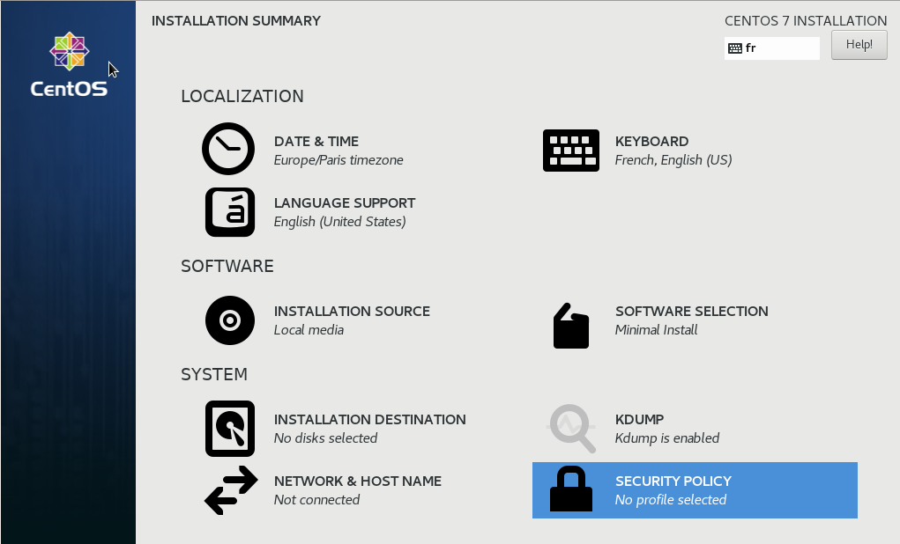
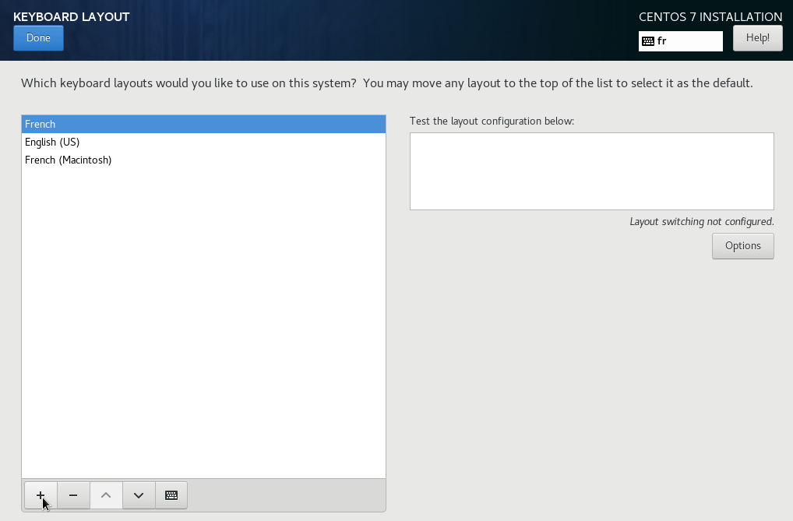
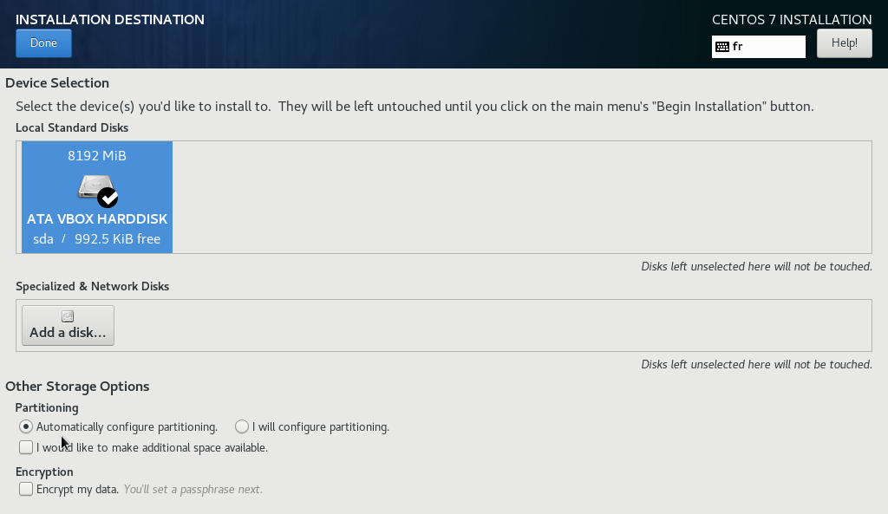
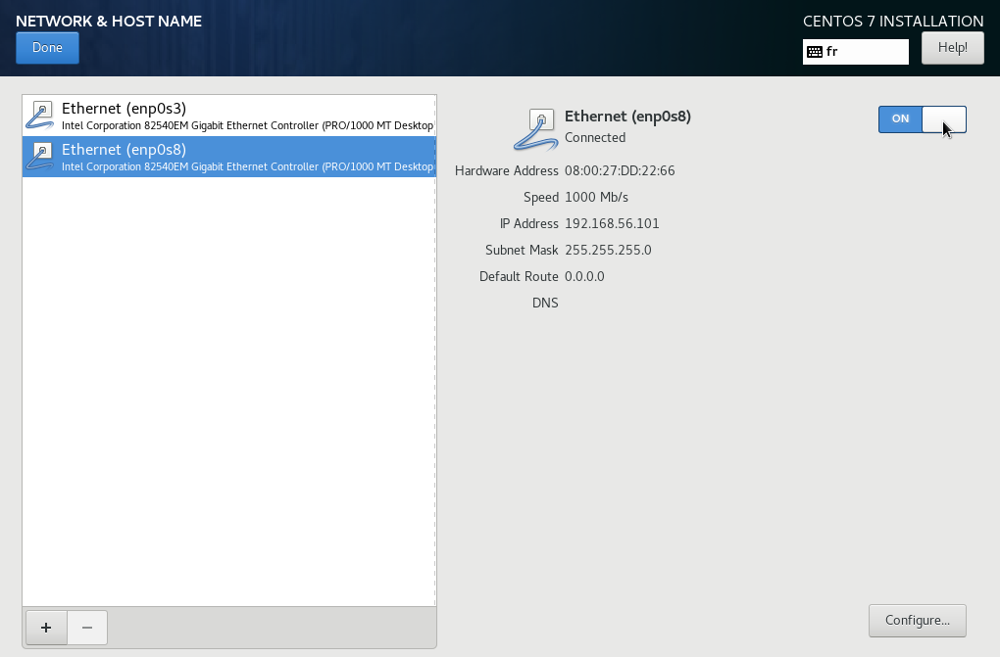
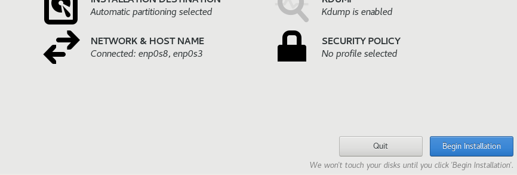
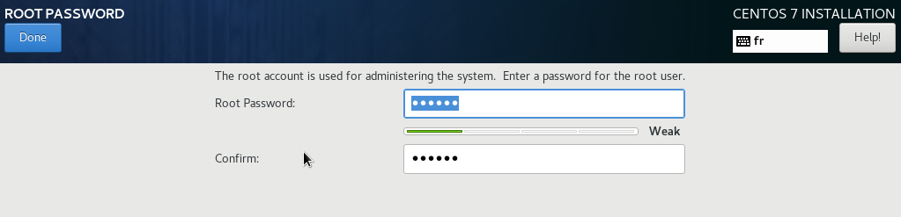

# Installation CentOS 7

## Environnement virtuel

Sous Virtual box :

* Configurez un reseaux host-only (privé hote) s'il n'existe pas déjà
* Créez une VM `CentOS7-fresh-install` avec
  * system Linux, Version RedHat 64b;
  * 1GB de RAM (512MB suffit) ;
  * un disque virtuel :
    * format VDI
    * Dynamically allocated (allocation dynamique)
    * de 8 à 10 GB
* Editez la VM
  * stockage : selectionner le cdrom et insèrez l'image iso : `CentOS-7-x86_64-Minimal-1810.iso`
  * Dans audio : désactivez l'audio (on en vraiment pas besoin pouir ce type de host)
  * Dans Network : Activez les deux premières carte réseaux la première en NAT (standard) mais placez la seconde dans le réseaux host only

Cette machine et votre VM ubuntu pourront communiquer au travers du réseaux host only (privé hote)

## Installation

Par défaut c’est une installation graphique :  



**Nous garderons la langue par défaut** : English  

**Date & time** : Mettez le TimeZone Paris  

**Keyboard** : Ajoutez (+) les types de clavier suivant votre besoin (mac ou latin) puis remontez, votre choix en premier de la liste : french, french(machintosh) ou autre



**Installation destination** : Entrez dans le menu vous pouvez ici laisser la configuration automatique sans aucune options. Cependant, il conviens pour une installation sur une machine physique de bien étudier cette partie le [partitionning](./partitionning.md)



**Kdump** : Laissez desactivé le kernel dump

**Network** : Activez seulement les deux cartes



**Begin Installation** :



**Pendant l’installation** :  

* Vous deffinirez le Mot de passe Root (a mémoriser)
* Vous ne crérrez pas de compte
* Après quelques minutes : Reboot



## Configuration de base

Configuration par defaut de l’image de base.

### réseau

Connectez vous avec le compte root et configurez les réseaux :

#### configurez la première carte réseaux

Pour être démarrée automatiquement : `ONBOOT="yes"`
Et avec une configuration minimale

Editez /etc/sysconfig/network-scripts/ifcfg-enp0s3 et supprimez le superflu (seul ces 4 lignes sont nécessaires)

```bash
[root@localhost ~]# vi /etc/sysconfig/network-scripts/ifcfg-enp0s3
[root@localhost ~]# cat /etc/sysconfig/network-scripts/ifcfg-enp0s3
TYPE="Ethernet"
BOOTPROTO="dhcp"
DEVICE="enp0s3"
ONBOOT="yes"
```

#### configurez la seconde carte réseaux

Pour être démarrée automatiquement : `ONBOOT="yes"`
Et avec une configuration minimale

Editez /etc/sysconfig/network-scripts/ifcfg-enp0s8 et supprimez le superflu (seul ces 4 lignes sont nécessaires)

```bash
[root@localhost ~]# vi /etc/sysconfig/network-scripts/ifcfg-enp0s8
[root@localhost ~]# cat /etc/sysconfig/network-scripts/ifcfg-enp0s8
TYPE=Ethernet
BOOTPROTO=dhcp
DEVICE=enp0s8
ONBOOT=yes
```

**relancer la configuration réseaux automatique :**

```bash
[root@localhost ~]# systemctl restart network.service
[root@localhost ~]#
```

**Validez la configuration :**

```bash
[root@localhost ~]# ip a | grep "inet "
    inet 127.0.0.1/8 scope host lo
    inet 10.0.2.15/24 brd 10.0.2.255 scope global dynamic enp0s3
    inet 192.168.56.101/24 brd 192.168.56.255 scope global dynamic enp0s8
```

Chez vous (avec de la bande passante réseaux) vous lancerez la VM CentOS7-fresh-install, vous vous connecterez dessus et vous taperez : `yum update` Votre VM source se mettra alors a jour.  

Afin de ne pas avoir à refaire l'installation et ces actions; Cette VM ne devra plus être utilisée directement (démarrée). Elle sera cloné, c’est votre Template de base centOS fraîchement installé.

**Eteignez votre VM :**
commande :

```bash
init 0
```

## Clonnez la VM

Dans la fenètre principale VirtualBox Clic souris boutons de droite sur la VM :  

* Choisissez `Cloner`  
* Nommez les nouvelle VM (CentOS7-test1)
* Cochez la case pour réinitialisé les adresse mac
* Selectionez linked clone (clone lié), Bouton clone
* Demarrez la Nouvelle VM

Si vous voulez savoir ce que signifies ces options demandez moi!

## Configuration d'une CentOS

Les actions sont faite sur la console en tant que root :

### Changer la localisation

Ces opérations ne sont pas forcément nécessaire. Ici vous voyez comment modifier les configurations faite à l'installation.  

Validez la configuration clavier : Testez le clavier, essayer de tapper les caractère : # & | a $ -  

Utilisez loadkeys pour changer le mappage clavier de la console :  

```bash
[root@localhost ~]# loadkeys fr-latin9
```

ou  

```bash
[root@localhost ~]# loadkeys fr-mac
```

Installez éventuelement le package des mappage clavier nécessaire :  

```bash
[root@localhost ~]# yum install kbd-misc
```

Pour garder cet configuration de façon rémanente :

```bash
localectl set-keymap fr
```

Validez la locale de root :

```bash
[root@localhost ~]# localectl status
   System Locale: LANG=en_US.utf8
       VC Keymap: n/a
      X11 Layout: n/a
[root@localhost ~]# echo $LANG
en_US.UTF-8
```

Validez la date / la Timezome :

```bash
[root@localhost ~]# export LC_TIME=en_US.UTF-8
[root@localhost ~]# date ; date -u
Thu Jan 18 22:37:58 CET 2018
Thu Jan 18 21:37:58 UTC 2018
```

Info :

* CET : Central European Time : c'est europe/Paris
* UTC : Universal Time Coordinated : c'est l'heure au méridien de greenwich

Pour modifier le timezone en interactif :

```bash
[root@localhost ~]# tzselect
```

### Gérer la date

Plusieurs options s'offrent à vous :

avec la commande date :

```bash
[root@localhost ~]# date -s '2018-01-01 00:00:00'
Mon Jan  1 00:00:00 CET 2018
```

avec le daemon ntpdate :

```bash
[root@localhost ~]# yum install ntpdate
[root@localhost ~]# ntpdate fr.pool.ntp.org
 3 Apr 21:54:46 ntpdate[1054]: adjust time server 178.33.111.47 offset -0.002966 sec
```

avec le daemon ntpd

Les deux premières options ne garantissent pas de rester synchrone par rapport au temps universel terestre le daemon ntpd lui vous garantis cela dans une certaine mesure. Sa mise en place est une bonne pratique à appliquer.  
voir la définition de [ntp](./definitions.md#NTP)

```bash
[root@localhost ~]# yum install ntp
[root@localhost ~]# systemctl start ntpd.service
[root@localhost ~]# systemctl enable ntpd.service
Created symlink from /etc/systemd/system/multi-user.target.wants/ntpd.service to /usr/lib/systemd/system/ntpd.service.
[root@localhost ~]# ps -ef | grep ntp | grep -v grep
ntp       1174     1  0 22:42 ?        00:00:00 /usr/sbin/ntpd -u ntp:ntp -g
```

### Instanciation

Instanciez un host en lui donnant un nom, en le plaçant dans une zone réseaux et en lui spécifiant une adresse IP statique sur ces réseaux.  
En entreprise ce host existe à partir de cette opération. Il est en général ajouté au référentiel des hosts au même moment et sur les serveurs DNS de l'entreprise.

Définir le hostname :  

```bash
[root@localhost ~]# hostname centos-test1
```

Mettez le en place de façon permanente :  

```bash
[root@centos-test1 ~]# hostnamectl set-hostname centos-test1
[root@centos-test1 ~]# cat /etc/hostname
centos-test1
```

Editez /etc/hosts afin que la VM se reconnaise au travers de son interface de loopback :  

```bash
[root@centos-test1 ~]# vi /etc/hosts
[root@centos-test1 ~]# cat /etc/hosts
127.0.0.1   centos-test1 localhost localhost.localdomain
::1         centos-test1 localhost localhost.localdomain
```

**Cette opération est nécessaire** lorsqu'elle est oubliée, elle peu être source de probleme pour certain services.

### Configuration réseaux

Pour définir une IP statique sur le reseaux host-only, éditez /etc/sysconfig/network-scripts/ifcfg-enp0s8 :

```bash
[root@centos-test1 ~]# vi /etc/sysconfig/network-scripts/ifcfg-enp0s8
[root@centos-test1 ~]# cat /etc/sysconfig/network-scripts/ifcfg-enp0s8
TYPE=Ethernet
BOOTPROTO=none
DEVICE=enp0s8
ONBOOT=yes
IPADDR=192.168.56.99
NETMASK=255.255.255.0
```

Puis relancer la configuration réseaux automatique :

```bash
[root@localhost ~]# systemctl restart network.service
[root@localhost ~]#
```

Validez la configuration:

```bash
[root@localhost ~]# ip a | grep "inet "
    inet 127.0.0.1/8 scope host lo
    inet 10.0.2.15/24 brd 10.0.2.255 scope global dynamic enp0s3
    inet 192.168.56.99/24 brd 192.168.56.255 scope global dynamic enp0s8
```

Configuration DNS :

Cette configuration n'est pas nécessaire dans ce cas précis car la première interface, qui est la gateway, est configurée en DHCP et récupère ainsi la configuration DNS :

```bash
[root@localhost ~]# cat /etc/resolv.conf
# Generated by NetworkManager
search lab.local
nameserver 10.0.2.3
```

Dans la plupart des autres cas (Dans le monde réel) le host sera entièrement configuré en IP fix et n'héritera pas d'une configuration DNS, il conviendra alors d’éditer ce fichier pour définir le serveur DNS local

### dé-sécurisation

Pour se simplifier la vie pour des hosts en environnement `lab` on peu désactiver le firewall et selinux afin de ne pas s'embèter avec la sécurité.

Désactivez le firewall :

systemctl permet de gèrer les services :  

* start/stop pour les démarrer ou les arrêter
* enable/disable pour qu'ils démarrent automatiquement au boot ou non

```bash
[root@localhost ~]# systemctl stop firewalld.service
[root@localhost ~]# systemctl disable firewalld.service
Removed symlink /etc/systemd/system/multi-user.target.wants/firewalld.service.
Removed symlink /etc/systemd/system/dbus-org.fedoraproject.FirewallD1.service.
```

Désactivez selinux pour le prochain reboot :

`disabled` au lieu de `enforcing`

```bash
[root@localhost ~]# vi /etc/sysconfig/selinux
[root@localhost ~]# grep -v "#" /etc/sysconfig/selinux | grep .
SELINUX=disabled
SELINUXTYPE=targeted
```

Débrayez selinux maintenant :  

```bash
[root@localhost ~]# setenforce 0
```

### Securisation

#### réactivation selinux et firewall

Bien sur vous n’aurez pas appliqué la dé-sécurisation présenté au chapitre précédent, si tel était le cas vous devriez alors revenir en arrière :

Ré-activez le firewall maintenant et a chaque boot :

```bash
[root@localhost ~]# systemctl start firewalld.service
[root@localhost ~]# systemctl enable firewalld.service
Create symlink /etc/systemd/system/multi-user.target.wants/firewalld.service.
Create symlink /etc/systemd/system/dbus-org.fedoraproject.FirewallD1.service.
```

Ré-sactivez selinux pour le prochain reboot :

`enforcing` au lieu de `disabled`

```bash
[root@localhost ~]# vi /etc/sysconfig/selinux
[root@localhost ~]# grep -v "#" /etc/sysconfig/selinux | grep .
SELINUX=enforcing
SELINUXTYPE=targeted
```

Ré-activez selinux maintenant :  

```bash
[root@localhost ~]# setenforce 1
```

#### actions minimales

Désactivation du login de root via le réseaux (ssh). Root pourra se connecter sur la console uniquement les droits pourront alors être aquis via `su` ou `sudo`. Un autre compte est donc indispenssable pour accèder à la machine via le réseau.

Commande useradd :  (option -m qui créer le “HOME” de l’utilisateur , option -G defini les Groupes ajouté à l’utilisateur, le groupe wheel donne les droits sudo)  

Remplacez newaccount par votre login

```bash
[root@localhost ~]# useradd -m -G wheel newaccount
[root@localhost ~]# id newaccount
uid=1001(newaccount) gid=1001(newaccount) groupes=1001(newaccount)
```

On defini le mot de passe  (celui-ci ne s’affiche pas)

```bash
[root@localhost ~]# passwd newaccount
Entrez le nouveau mot de passe UNIX : p455W0rd
Retapez le nouveau mot de passe UNIX : p455W0rd
passwd : le mot de passe a été mis à jour avec succès
```

Vérifiez les droits sudo:
Commande visudo :

```bash
[root@localhost ~]# visudo
```

Afin de donnez les droits au group wheel : Décommentez (enlevez le #) la ligne suivante

```bash
## Allows people in group wheel to run all commands
%wheel  ALL=(ALL)       NOPASSWD: ALL
```

Interdisez le login de root via ssh:

En décommantant et en modifiant la valeur de RootLogin du fichier /etc/ssh/sshd_config :

```bash
…/…
#LoginGraceTime 2m
PermitRootLogin no
#StrictModes yes
…/…
```

N’oubliez pas de redémarrer le service afin que le changement de configuration soit pris en compte par le service

```bash
[root@localhost ~]# systemctl restart sshd.service  
```

#### Sécurisation plus stricte

Nous allons interdir la connexion par mot de passe il faudra alors permettre la connexion avec une authentification par clef :

Depuis votre laptop si c'est Unix like (mac ou linux) sinon depuis votre VM ubuntu.

Créez une pair de clef publique et privée pour votre compte :

Vous devrez saisir une passphrasse sécurisant votre clef privée.

```bash
leo@laptop:~$ ssh-keygen
Generating public/private rsa key pair.
Enter file in which to save the key (/home/leo/.ssh/id_rsa):
Enter passphrase (empty for no passphrase):
Enter same passphrase again:
Your identification has been saved in /home/leo/.ssh/id_rsa.
Your public key has been saved in /home/leo/.ssh/id_rsa.pub.
The key fingerprint is:
SHA256:IVwMAIFEuLMbVn/q0A+1eBrIhyvrpOuo+aj/RHFcVVM leo@laptop
The key's randomart image is:
+---[RSA 2048]----+
|++oo...oo...o.E  |
|o    o o.    .   |
| .  . = .        |
|o  . o . .       |
| o. o  .S        |
|o...+.o..        |
|.+ =.*oo         |
|=+ .+.*          |
|&B=ooo .         |
+----[SHA256]-----+
leo@laptop:~$ cat .ssh/id_rsa.pub
ssh-rsa AAAAB3NzaC1yc2EAAAADAQABAAABAQC0T/jSURMlz9LmiiTI1PNtwQt2OSRFM3q1meIxkhpuESYPx2fwYahfzzpTdfqgIXaRs/2YqU+tVtOrN4z9DBpAGZ5O4zgYBH9/ACm8hShORUe/jbfxX4iWCScaIZaavnWJxb2qPYj3lNzAhA0ceRGqznn83mJJlgQPCDDRoYAkpMCbgmZ0pvatx8/L2atV4V26MhK9isbbJWCXafHDh9sfcPahSqfQyr8LZqUdZyjh/hhKbvTFIWnv+nB6LiPwzVzBoucgOP7TJ4R9DRyXP4nsL3wJ4DUNKH8JAx0kWOBD1r8qaOevsAm40JjavVabBtMlF48q4RVT0bDTtPC7Lis9 leo@laptop
leo@laptop:~$
```

Vous devrez ajoutez votre clef publique dans les "authorizeds keys" de votre login sur le host :  

cela peut être fait automatiquement par le script `ssh-copy-id`:

```bash
leo@laptop:~$ ssh-copy-id newaccount@192.168.56.99
/usr/bin/ssh-copy-id: INFO: Source of key(s) to be installed: "/home/leo/.ssh/id_rsa.pub"
The authenticity of host '192.168.56.101 (192.168.56.101)' can't be established.
ECDSA key fingerprint is SHA256:sCZkgGfozArBgm/ObjDt4LP4PN4/ksO9JCLtVokwwxA.
Are you sure you want to continue connecting (yes/no)? yes
/usr/bin/ssh-copy-id: INFO: attempting to log in with the new key(s), to filter out any that are already installed
/usr/bin/ssh-copy-id: INFO: 1 key(s) remain to be installed -- if you are prompted now it is to install the new keys
newaccount@192.168.56.101's password:

Number of key(s) added: 1

Now try logging into the machine, with: "ssh 'newaccount@192.168.56.99'"
and check to make sure that only the key(s) you wanted were added.

leo@laptop:~$ ssh root@192.168.56.99
Enter passphrase for key '/home/leo/.ssh/id_rsa':
Last login: Sun Apr 28 18:06:35 2019
[newaccount@localhost ~]$
```

Notez bien les droits : 700 pour le dossier et 600 pour le fichier, cette restriction est nécessaire , ces droits sont vérifié par ssh à chaque connexion.

```bash
[root@localhost ~]# ls -ald /home/newaccount/.ssh/authorized_keys /home/newaccount/.ssh
-rwx------ 1 newaccount newaccount  29 Apr  3 23:11 .ssh
-rw------- 1 newaccount newaccount 395 Apr  3 23:11 .ssh/authorized_keys
[root@mail ~]# cat /home/newaccount/.ssh/authorized_keys
ssh-rsa AAAAB3NzaC1yc2EAAAADAQABAAABAQC0T/jSURMlz9LmiiTI1PNtwQt2OSRFM3q1meIxkhpuESYPx2fwYahfzzpTdfqgIXaRs/2YqU+tVtOrN4z9DBpAGZ5O4zgYBH9/ACm8hShORUe/+…
```

Maintenant, interdisez le login par mot de passe:  

En décommantant et en modifiant la valeur de PasswordAuthentication du fichier /etc/ssh/sshd_config :

```bash
…/…
# To disable tunneled clear text passwords, change to no here!
PasswordAuthentication no
#PermitEmptyPasswords no
…/…
```

N’oubliez pas de redémarrer le service pour prendre en compte la modification :

```bash
[root@localhost ~]# systemctl restart sshd.service  
```

**Pour chaque nouveau service activé sur le host, il conviendra d'appliquer les bonnes pratiques de sécurisation de celui-ci.**

### Exemple de sécurisation suplémentaires

* Sauvegarder les données sur un site distant, maitriser et valider les procédures de restauration associées, **c'est la priorité.**
* Surveiller les services et ressources (monitoring)
* Auditer et valider les règles firewall de l'infra
* Mettre en place d'un fail2ban pour chaque service réseaux proposant une autentification : Une ip qui échoue plusieurs fois à s'authentifier se voie interdite de connexion au travers d'une règle firewall. Attention a ne pas bloquer tout le monde.
* Mettre en place du [Port Knocking](./Port%20Knocking.md).
* vérifier l'intégrité de ses fichiers avec [tripwire](https://github.com/Tripwire/tripwire-open-source) necessaire pour un host "ouvert" aux utilisateurs
