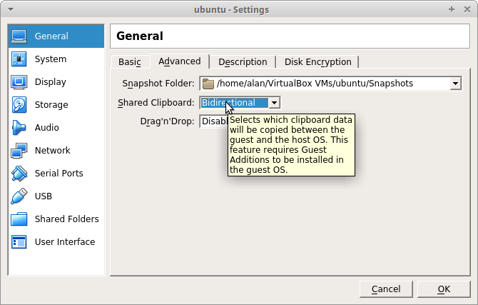

# Installation Ubuntu desktop

## Environnement virtual box

Une installation doit se faire sur une machine. Oui c'est évident.
Nous allons utiliser une machine virtuelle et donc l'outil VirtualBox.

### Configuration Virtual Box

Il faudra configurer virtualBox pour avoir une interface host-only disponible :

Détails

Allez dans les globals tools / Network :

Ajoutez et/ou editez un réseaux hostonly :

Précisez bien les spécifications de votre réseau virtuel en activant le DHCP et en précisant la plage d'adresses DHCP à partir de xx.xx.xx.101 (et non pas xx.xx.xx.1) : 

### Configuration de la VM

Configurez une VM ubuntu avec :

* Mémoire : 2048MB (min)
* CPU : 1 coeur
* un disque : 10GB
* 2 cartes réseau
  * NAT (standard)
  * Host only
* pas de lecteur de disquette

Suivez bien les étapes définies ci dessous.

étapes

* Dans les machine tools cliquez sur new en haut à gauche

* Définissez le nom de votre VM son type et la version Ubuntu

* Précisez la quantité de mémoire

* Créez un disque virtuel

* De type **V**irtualBox **D**isk **I**mage

* En stockage dynamique (le fichier disque qui contient les données écrites sur le disque s'agrandit au fur et à mesure)

* De 10GB

* On édite la VM

* On désactive le lecteur de disquette ça existe plus ça !

* Un core

* On s'assure que le vt est actif (le nested paging peu poser des problèmes si votre laptop le gère mal).

* Activez la seconde carte réseau en host-only

* Activez le buffer copier-coller bidirectionnel

* insèrer un cd-rom virtuel (une iso)

* Sélectionez l'image `iso` d'installation

### Installation ubuntu

Effectuez une installation standard :

* On va faire du "Next Next Next" : Cela veux dire lire le texte et choisir les options standards et évidentes
* Attention à comprendre ce que vous faites à chaque étape.
En particulier :
  * Ne pas télécharger les updates pendant l'install (vous le ferez plus tard)
  * Installer les logiciels tier (cela ne coûte pas grand chose)
  * Utiliser des noms explicites : (votre prénom pour le compte c'est simple et facile)
  * **Notez bien de votre mot de passe**

#### Suivez bien les détails ci-dessous

détails

* Démmarez la VM.

* Notez bien les messages VirtualBox lisez les, comprenez les, puis cachez les définitivement.

* Une installation en anglais bien sûr !

* Mais avec le clavier qui **VOUS** convient.

* installation Minimale et avec les logiciels tiers et **SANS** installer les mises à jour (vous le ferez plus tard).

* On écrasera le disque (c'est un disque virtuel).

* Oui on confirme.

* On est en France.

* Un compte, un nom de host un mot de passe **A RETENIR**.

* On attends un peu.

* Puis on reboot.

### Utilisation

Connectez-vous !

Une petite présentation vous acceuille, suivez là, prenez le temps.

## Conclusion

Bah, rien de complexe.  
En bas à gauche les applications, vous rechercherez "term" et vous lancerez aussi un terminal.

Nous allons parler du [shell](./shell.md).
