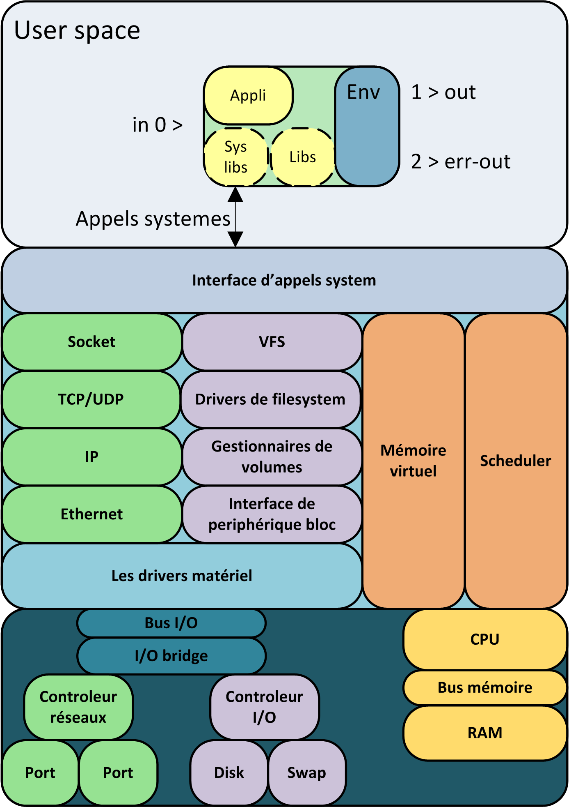

# le démarrage du système

## Le POST et/ou le BIOS

Les cartes électroniques programmables effectuent à leur démarrage une initialisation et un test de fonctionnement : le **P**ower **O**n **S**elf **T**est ou le **POST** cela n'est pas lié uniquement aux ordinateurs.

Le firmware est le code exécutable intégré au hardware : "firm" pour ferme est à mi chemin and "hard" et "soft" c'est du logiciel intégré au hardware via une ROM (Read Only Memory) une EEPROM (Electrically Erasable Programable Read Only Memory) ou une mémoire flash. 

**Le Bios** : **B**asic **I**nput **O**utput **S**ystem est le firmware des cartes mère des Ordinateurs compatibles PC. Il permet au système d'exploitation de s'abstraire de l'architecture de celle-ci.  

Dans certains cas le bios peut proposer un menu de configuration du matériel et du bios lui même voire de lancer un bios secondaire pour configurer une carte fille. (certaine carte fiber channel ou SCSI)

La principale fonction du bios est de détecter et d'initialiser le matériel, écrire les paramètre matériel en RAM à une certaine adresse, sélectionner le périphérique de boot, puis de charger le **boot loader** qu'il contient en ram et sauter (instruction jump) sur sa première instruction machine.

## Le boot loader

Le boot loader est un programme de trés petite taille (446 Octets) qui a pour seul but de lancer le système d'exploitation : 

Il :

* Trouve le fichier contenant le kernel ;
* Le décompresse et le charge en mémoire avec ses paramètres
* Et enfin saute (instruction jump) sur sa première instruction machine

### Grub :

**GR**and **U**nified **B**ootloader est la référence pour linux sur PC.

Il est placé sur le MBR du premier support de stockage. Plus précisément sa première partie (stage 1 ou boot.img) y est placé. Celle-ci charge alors son complément (stage 1.5 ou core.img) qui lui chargera la partie 2 du boot loader (avec le menu) permettant enfin de lire, décompresser, charger en ram puis lancer le kernel.

### Lilo

Lilo (Linux Loader) est le boot loader historique de linux, il était un peu plus rudimentaire que Grub et nécessitait une ré-écriture sur le MBR en cas de changement.

### U boot

Uboot : Universal Boot loader, pour les archi PPC ou ARM.

Dans les systèmes embarqués, les contraintes font que l'on utilise un boot loader encore plus rudimentaire. Ce dernier n'a pas besoin de gérer plusieurs cas. Il n'est capable de charger qu'un seul système et il sait d'avance où est placé le kernel sur le support. Enfin il se contente de le charger en mémoire (après quelques manipulations sur la ram) puis de sauter sur sa première instruction.  

## Le Kernel

Le noyau du système d'exploitation exécute alors ses routines d'initialisation en fonction des paramètres qui lui sont transmis en argument.  

### Paramètres

Les principaux paramètres transmis au kernel 

* init=/sbin/init (optional car c'est la valeur par défaut)  
* root=/dev/device (nécessaire, la racine de l'arbo)  
* single (optionnel pour imposer le démarrage en mode single user)  
* ro / rw (montage de / en ReadOnly ou en ReadWrite pendant le boot)  
* panic=N (optionel impose au kernel de rebooter en cas de panic au bout de N secondes)  
* maxcpus=N (permet de réduire le nombre de CPU)  
* mem=2048M (permet de réduire la mémoire utilisable)  
* hdb=noprobe (permet de désactiver le disque hdb)  
* initrd /boot/initrd.img : spécifie l'image initrd à utiliser (voir plus bas)  

### Gestion du matériel :

Le kernel récupère l'architecture matériel placé en mémoire par le **bios**. Puis il lit sur l'arborescance et charge en mémoire les **modules** (ou composants du noyau) contenant les pilotes (drivers) associés au matériel détecté.



#### log

En sortie de la commande `dmesg` ou traité sur la facility 0 de la [syslog](./syslog.md) on retrouve les traces d'initialisation du kernel permettant d'identifier d'éventuels incidents sur la gestion du matériel par le noyau.

#### montage de la racine de l'arborescance

**Le paradoxe du driver de stockage** : Pour monter l'arborescance `/` il faut le driver permettant de gérer le volume et le filesystème, hors ces driver/modules sont sur cette arborescance. (Deadlock)

Au démarrage une image minimale de l'arborescance est chargée en RAM une image du filesystème `initrd` (pour init RAM disk) afin que le kernel puisse initialiser ses drivers.

Juste après le kernel peut alors monter le filesystème / sur le point de montage / ; au-dessus de l'image disque de boot. Suivant les cas il peut être monté en Read Only

## Init

Enfin le kernel démarre le processus **init** le processus de PID 1.

Celui-ci vérifie et monte les filessystème définis dans le fichier /etc/fstab

Puis démarre les services pour atteindre un niveau de service ou **Run level** ou Target sous systemd.

Il existe plusieurs implémentation du système init, init system V, init BSD, 

### init system V

Cette implémentation à été très longtemps utilisé dans les distribution Linux et sur les systèmes Unix propriétaire dit compatible system V

#### Run level

Le run level ou niveau de service représente le niveau de démarrage du système c'est un numérique allant de 0 à 6.

La commande `init` permet d'ordonner au processus init de changer de runlevel on lui transmet le run level souhaité en argument.

* 0 : Système arreté, matériel éteint
* 1 : Le mode single user, quasiment aucun service n'est démarré, le réseau n'est pas initialisé.
* 2 : Le réseau est initialisé et les services minimum sont démarrés (run level par défaut sous debian)
* 3 : Run level permettant d'ajouter des services (valeur par défaut sous centOS)
* 4 : User define, permet de définir un niveau supplémentaire
* 5 : Sur certaine distribution défini le mode graphique le système graphique est alors démarré
* 6 : Utilisé en argument de la commande init on obtient le reboot du system

Pour arrêter un serveur :
 
```bash
# init 0
```

#### /etc/inittab

Le fichier initab (provenant d'unx system V) est la configuration d'init, celui-ci est de moins en moins utilisé sur les systèmes linux.

Structure : ID:lst-niv:action:process

* ID : Un identifiant unique de ligne (1 à 4 caratères)
* lst-niv : La liste des niveaux de démarrage concernés par cette entrée.
* action : La façon dont le process doit être lancé
* Process : La commande à lancer par init.

Exemple pour un système solaris 8
```bash
ap::sysinit:/sbin/autopush -f/etc/iu.ap
ap::sysinit:/sbin/soconfig -f/etc/sock2path
fs::sysinit:/sbin/rcS sysinit>/dev/console 2<>/dev/console </dev/console 
is:3:initdefault:
p3:s1234:powerfail:/usr/sbin/shutdown-y -i5 -g0 >/dev/console 2<>/dev/console
sS:s:wait:/sbin/rcS>/dev/console 2<>/dev/console </dev/console 
s0:0:wait:/sbin/rc0>/dev/console 2<>/dev/console </dev/console 
sl:l:respawn:/sbin/rcl>/dev/console 2<>/dev/console </dev/console 
s2:23:wait:/sbin/rc2>/dev/console 2<>/dev/console </dev/console 
s3:3:wait:/sbin/rc3>/dev/console 2<>/dev/console </dev/console 
s5:5:wait:/sbin/rc5 >/dev/console 2<>/dev/console </dev/console 
s6:6:wait:/sbin/rc6>/dev/console 2<>/dev/console </dev/console 
sc:234:respawn:/usr/lib/saf/sac -t 300
co:234:respawn:/usr/lib/saf/ttymon -g -h -p "`uname -n` console login: " -T sun -d /dev/console -l console -m ldterm,ttcompat
```

Ici la ligne `is:3:initdefault:` définit le run level souhaité par défaut au boot. Dans les dernière utilisation connues de ce fichier seul cette entrée subsistait.

#### Scripts de démarrage des services

On retrouve encore aujourd'hui quelques "produits" open source intégré avec un script de démarrage system V. Celui-ci est placé dans de dossier `/etc/init.d/`. Il porte en général le nom du produit et prend comme argument `stop`, `start`, `restart` ou encore `reload`.

Un lien symbolique vers ses scripts est placé dans les répertoire /etc/rcX.d où X prend la valeur du run level. Celui-ci est nommé soit SXX_nomduproduit, soit KXX_nomduproduit avec XX un entier incrémenté pour définir l'ordre de démarrage ou d'arrêt avec S pour start et K pour stop.

Init venait alors lister les scripts commençant par S et les exécutait en leur passant l'argument `start` et les script commençant par K avec l'arguement `stop` pour atteindre le run level.

Le démarrage était séquenciel et l'ordre d'exécution était donné par les incréments XX

La commande service nomduproduit start venait chercher le script dans /etc/init.d/nom du produit pour le démarrer.

### systemd

Systemd remplace le daemon standard init sur les distribution Linux, il accélère le démarrage du system car il parallélise l'exécution des opérations de démarrage.

La résolution des dépendances interprocessus est accélérée par :

* La création des sockets de communication pour les daemons avant de lancer les daemons.
* L'attente de l'obtention du nom DBUS pour passer au service suivant au lieu d'attendre la fin du démarrage complet du service.

#### definition d'un service

Les scripts de démarrage exécutait toujours les mêmes actions :

* Démarrer le processus avec certains arguments
* Sauvegarder son pid dans un fichier
* Envoyer un kill sur le pid

Systemd a intégré ces actions et permet lors de l'intégration d'un produit dans une distribution de ne plus avoir à re-créer un script de demarrage.


```bash
# cat /usr/lib/systemd/system/crond.service
[Unit]
Description=Command Scheduler
After=auditd.service systemd-user-sessions.service time-sync.target

[Service]
EnvironmentFile=/etc/sysconfig/crond
ExecStart=/usr/sbin/crond -n $CRONDARGS
ExecReload=/bin/kill -HUP $MAINPID
KillMode=process

[Install]
WantedBy=multi-user.target
```

#### Les Targets  

Sous systemd une `target` remplace le run level, il est défini par un dossier sous  : /etc/systemd/system/xxxxxx.target.wants

Ce dossier contient des liens vers les fichiers de définition de service systemd

```bash
# ls -al /etc/systemd/system/multi-user.target.wants
total 8
drwxr-xr-x.  2 root root 4096 28 avril 16:29 .
drwxr-xr-x. 11 root root 4096 28 avril 16:33 ..
lrwxrwxrwx.  1 root root   38 28 avril 16:29 auditd.service -> /usr/lib/systemd/system/auditd.service
lrwxrwxrwx.  1 root root   37 28 avril 16:28 crond.service -> /usr/lib/systemd/system/crond.service
lrwxrwxrwx.  1 root root   41 28 avril 16:29 firewalld.service -> /usr/lib/systemd/system/firewalld.service
lrwxrwxrwx.  1 root root   42 28 avril 16:29 irqbalance.service -> /usr/lib/systemd/system/irqbalance.service
lrwxrwxrwx.  1 root root   37 28 avril 16:29 kdump.service -> /usr/lib/systemd/system/kdump.service
lrwxrwxrwx.  1 root root   46 28 avril 16:28 NetworkManager.service -> /usr/lib/systemd/system/NetworkManager.service
lrwxrwxrwx.  1 root root   39 28 avril 16:29 postfix.service -> /usr/lib/systemd/system/postfix.service
lrwxrwxrwx.  1 root root   40 28 avril 16:28 remote-fs.target -> /usr/lib/systemd/system/remote-fs.target
lrwxrwxrwx.  1 root root   46 28 avril 16:28 rhel-configure.service -> /usr/lib/systemd/system/rhel-configure.service
lrwxrwxrwx.  1 root root   39 28 avril 16:29 rsyslog.service -> /usr/lib/systemd/system/rsyslog.service
lrwxrwxrwx.  1 root root   36 28 avril 16:29 sshd.service -> /usr/lib/systemd/system/sshd.service
lrwxrwxrwx.  1 root root   37 28 avril 16:29 tuned.service -> /usr/lib/systemd/system/tuned.service
```

#### systemctl

La target par défaut peut être récupérer via la commande `systemctl`

```bash
# systemctl get-default
multi-user.target
```

Cette même commande permet de définir la target par défaut

```bash
# systemctl set-default multi-user.target  
```

Ou simplement d'activer(enable), démarrer(start), désactiver(disable) ou arrêter(stop) un service :

```bash
# systemctl start httpd
```

