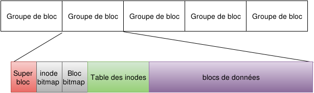

# Stockage des données

## Les systèmes de fichiers

Le système de fichier est un espace de données organisé afin de porter des fichiers et des dossiers.

Les systèmes de fichier de type UFS(Unix FileSystem) et ext sont organiseés comme sur l'image suivante :



Un groupe de bloc est un ensemble de blocs de données contigu, il contient :

* Une copie du Super bloc
* Une carte (bitmap) des inodes et des blocs occupés
* Une tables d'inodes
* Des blocs de données

Le filesystem contient alors une copie du super bloc pour chaque groupe de bloc.

### Le super bloc

Le super bloc est un espace de données qui contient la définition du système de fichier le `magic number` qui définit le type de system de fichier et la géométrie du système de fichier :

* comment sont placés les groupes de blocs,
* la taille des bloc de données
* le nombre d'inode par groupe de blocs
* son état (ouvert/fermé)

### Un fichier

Un fichier est identifié par son noeud d'index : l'inode c'est un numéro unique d'identification du fichier sur le système de fichier.


Cet inode est le point d'entrée du fichier elle définit les attributs de fichier : le mod, le owner, le groupe, la taille etc... et un ensemble de pointeur vers des blocs de données. Certains de ces blocs pouvant eux aussi contenir des pointeurs vers d'autre blocs (jusqu'à 3 niveau)

Ainsi les dossiers ne sont que des listes de noms de fichier chacun étant associé à un inode, on comprend mieux le principe des liens physiques. Aussi un fichier ne connait pas son nom.

### Commandes

#### df

df : permet de consulter l'usage des filesystème actuellement utilisés

* `df -h` : h pour human readable
* `df -l` : l pour local, on ne consulte l'usage que pour les filesystem locaux
* `df -i` : i pour inode : présente l'usage des inodes : % d'occupation des inodes

#### mount / umount

Les commandes mount et umount permettent de monter ou démonter un système de fichier.

Le montage consiste à **ouvrir** un système de fichier et le rendre disponible sur l'arborescence du système. Le dossier sur lequel est monté un système de fichier est appelé "point de montage".

exemple :

```bash
prompt$ mount -t ext4 /dev/sdb1 /mnt/disk
prompt$ umount /mnt/disk
```

Ici on monte le système de fichier contenu sur la première partition du disque sdb sur le point de montage /mnt/disk, puis on le démonte.

#### mkfs

`mkfs` est l'utilitaire de formatage des partitions. Son utilisation écrase tout le contenu d'un disque pour créer un système de fichier : MaKeFileSystem : mkfs

exemple :

```bash
prompt$ mkfs -t ext4 -L temp-disk  /dev/sdb1
```

Ici on vient formater la première partition du disque sdb en lui donnant le label 'temp-disk'

#### fsck

`fsck` est l'outil de vérification et de réparation des systèmes de fichiers. Il vérifie l'intégrité du système de fichier et corrige les éventuelles erreurs.

```bash
$ sudo fsck /dev/sdb1
fsck from util-linux-ng 2.17.2
e2fsck 1.41.12 (17-May-2010)
fsck.ext3: Superblock invalid, trying backup blocks...
NEWDSK was not cleanly unmounted, check forced.
Pass 1: Checking inodes, blocks, and sizes
Pass 2: Checking directory structure
Pass 3: Checking directory connectivity
Pass 4: Checking reference counts
Pass 5: Checking group summary information

NEWDSK: ***** FILE SYSTEM WAS MODIFIED *****
NEWDSK: 11/50200 files (0.0% non-contiguous), 12001/200780 blocks
```

#### resize2fs / tune2fs

* La commande `resize2fs` permet de redimensionner les systèmes de fichiers de type `ext` par exemple après avoir redimensionné le volume logique qui le supporte.
* La commande `tune2fs` permet de modifier certains paramètres des systèmes de fichier de type ext la commande suivante permet de désactiver la vérification de l'intégrité du Fs après un certains nombre de montages :

  ```bash
  tune2fs -c 0 /dev/sdb1
  ```

### Le fichier /etc/fstab

Le fichier /etc/fstab contient les systèmes de fichier connus du système. Ce fichier permet :  

* Le montage automatique des systèmes de fichiers au boot de la machine.
* de réduire les paramètres à passer à la commande `mount` à la partition ou au point de montage

Exemple :

```bash
/dev/sda1 /                 ext4    defaults        1 1
/dev/sda2 /boot             ext4    defaults        1 2
/dev/sda3 swap              swap    defaults        0 0
tmpfs     /dev/shm          tmpfs   defaults        0 0
sysfs     /sys              sysfs   defaults        0 0
proc      /proc             proc    defaults        0 0
```

Format :

* Device / partition
* Point de montage
* Type : le format du système de fichier
* Option
* Fréquence de dump (sauvegarde au sens POSIX)
* fs_passno : ordre de vérification de l'état du filesystème au boot
  * 0: pas de vérification
  * 1: en premier (pour /)
  * 2: tout les suivants
