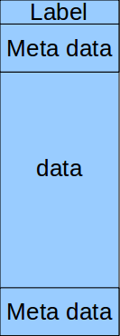
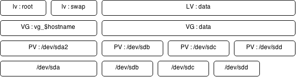

# LVM

## Présentation

LVM pour logical volume manager permet de définir des volumes logique indépendant des volume physique. Il offre un grand nombre de fonctionalités sur la gestion des volumes (mirroring, snapshot, redimentionnement etc... )

Les volumes physiques (PV) sont regroupé dans un Volume Group (VG) et découpé en bloc de données appelé Physiqcal Extend (PE)

A la création d'un volume physique un label unique est écrit en début de disque, un espace est réservé juste après en en fin de disque afin d'écrire l'ensemble des données relatives à LVM

Un PV :

Un volume logique (LV) est défini comme un ensemble de ces blocs de données. Ansi un volume logique peu être stocké sur plusieurs volumes physique. en cas de mirroring chaque bloc est stocké en plusieurs copies et chacune sur un volume physique différent.

## Commandes LVM

Les volumes physiques, les volume group et les volumes logiques sont gèré par les commandes LVMs :

* `[pv|vg|lv]display` : affiche les caractèristique d'un pv vg ou lv
* `[pv|vg|lv]create` : créer un des objet LVM
* `[pv|vg|lv]remove` : suppime un des objet LVM
* `vgextend` : permet d'ajouter un volume physique à un volume groupe
* `vgreduce` : permet d'enlever un disque d'un volume group
* `pvmove` : permet de déplacer les bloc de donnée d'un volume physique vers un autre
* `lvconvert` : permet de modifier la répartition des blocs
* `lvchange` : Permet de modifier les attribut d'un volume logique
* `lvresize` : permet de redimentionner un volume logique

La pratique est encore le meilleur moyen de comprendre alors voici un [TD](TD-lvm.md)
