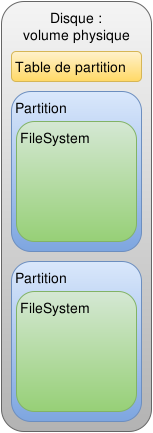

# Gestion du stockage sous linux

De façon globale, la donnée est ce qui est le plus important. L'outil informatique permet d'automatisé sont traiement cependant sa pérénité reste plus importante que son traitement.
La gestion du stockage de la donnée est donc primordiale.

## Les supports physique

Les périphérique de stockage (disques et autre SSD) sont utilisés au travers d'un bus interface lui même géré par un contrôleur pouvant offrir des fonctionnalités.

### Les supports physiques

* Les bandes magnétiques, oui elle sont toujours utilisée car elle permettent de stocker plusieurs tera Octet de données sur un support peu couteux, facilement transportable et disposant d'une vitesse de lecture ou d'écriture importantes (voir [wikipedia: LTO](https://fr.wikipedia.org/wiki/Linear_Tape-Open))
* Les "disques dure" (Hard drive) sont contruit à partir de disques magnétiques tournant à vitesse constante et disposant de têtes de lectures mobile éfleurant les disques (à quelques microns mettres). Ces supports de stockage reste le plus courant pour le moment.(voir [wikipedia: disques dur](https://fr.wikipedia.org/wiki/Disque_dur))
* Les SSD (Solid State Drive) sont quant à eux des support physique n'ayant aucune mécanisme physique. il sont entièrement contruit sous forme de semi conducteur organisé dans des puces éléctronique. Rapide, légé, consommant peu d'énergie c'est le support de stiockage du future mais attention à la pérénité de la donnée. ([wikipedia: ssd](https://fr.wikipedia.org/wiki/Solid-state_drive))

### Les bus d'interfaces de stockage

Les disque sont des périphérique autonome accessible au travers d'une interface bus.

* IDE : historique toujours présent pour les cdrom devenu par la suite ATA (Advanced Technology Attachment)
* SATA : Pour Serial ATA
* SCSI : historique mais toujours utiliser pour les périphérique de stockage des sauvegarde notemment
* SAS : Pour Serialized Attached SCSI
* FC : Pour Fiber Channel un bus sérialisé très performant

### Les contrôleurs

Sur les serveurs physiques on retrouve régulièrement des cartes Controleur RAID permettant d'organiser la donnée sur plusieurs disques au niveau matériel tout en en présentant qu'un seul virtuel au système.

Quelques exemples de configurations RAID bien connues:

* RAID 0 : stripe concaténation des disques
* RAID 1 : mirroir, les données sont lue et écrite sur 2 disques en même temps (redondence)
* RAID 10 : stripe de mirroir
* RAID 5 : répartition des données sur tout les disques (au moins 5) en calculant et sauvegardant un bloc de parité suplémentaire sur l'un des disques. en cas de perte de l'un des disques la donnée perdue peut être reconstruite en utilisant le bloc de parité
* RAID-dp : dp pour double parité comme le raid 5 mais avec 2 bloc de parité sauvegardé et donc maintien la donnée y compris dans le cas de la parte de 2 disque

Chacune de ces solution à des avantage et des incovénients. Il conviens donc de bien étudier ces solutions et le besoin pour faire un choix.

Les contrôleur offrent en plus de la mémoire cache permettant de fluidifier et d'accèlerer les lectures et écritures.
**Attention** a bien choisir les options de vos serveurs : En cas de perte d'alimentation du serveur, la donnée n'est réellement préservé que dans le cas ou la carte contrôleur dispose d'une batterie alimentant la mémoire cache, et c'est souvent une option.

## Les Partitions

Les volumes vues du système et issue de la configuration physique est un ensemble de bloc de données. celui-ci peut être divisé en plusieurs partitions. chacune de ces partitions sera vu par le système d'exploitation comme un volume de donnée.

Une fois qu'une partition est formaté, elle devient alors un [filesystème](./filesystem.md) mais on vera ça un peu plus tard.

### Partition au format PC

Système de partitioning historique des ordinateurs au standard PC/AT occupe **64 octets** sur le disque juste après le MBR (Master Boot Record), positionné sur les octets physique numéro 447 à 510 sur le disque.

Il existe 4 partitions primaires, elles sont détectées par le BIOS et sont limitées en taille à 2.2 TB.

Une des partitions primaire peut contenir des partition dites étendues. Elle sont liée entre elles, chacune d'entre elles commencent par un EBR (Extended Boot Record) contenant deux entrées :

* le première définit la partition courante
* la seconde si non null définit la partition etendue suivante.

#### fdisk

La commande `fdisk` permet de lire et de modifier la table de partition au format PC.

* `fdisk -l` liste les partitions
* `fdisk /dev/sda` permet d'éditer le volume physique /dev/sda

Cet outil est interactif et propose un menu, on utilisera la touche m pour lister les options disponibles, et n (new) pour créer une nouvelle partition, l'outil propose des choix par défaut entre parenthèses.  

### Partitionement Guid Partition Table

Suite à l'augmentation substantiel de l'espace de stockage disponible sur les volumes physiques, le système de partitionnement "Guid Partition Table" a été créé dans les spécifications d'UEFI.

Ce dernier système vient s'implanter dans la première partition primaire du volume physique qui est alors définie pour occuper tout l'espace du volume.

La table de partition est conservé en début et en fin de volume et n'est visible au boot que par UEFI.

#### Parted

Gnu parted est un outil avancé de gestion de partition, il permet de gèrer les partition GPT.

* `parted -l` : liste les partitions
* `parted /dev/sda` : permet d'éditer la table des partition du disque /dev/sda

### Partitionnement idéal pour un système gnu/Linux

Chaque cas et chaque besoin nécessite d'être étudié afin de définir le partitionnement idéal. On retiendra en général un volume de boot contenant le bootloader et le kernel, le volume racine de l'arborescence puis le volume contenant l'espace de [swap](./definitions.md#swap)

En revanche, dans une situation avec un seul disque, il peut être pratique de définir une partition primaire de boot contenant les fichiers nécessaires au boot puis une seconde partition occupant le reste du volume physique et qui sera utilisé comme volume physique LVM. Cette configuration est suffisante et très courante en particulier pour les serveurs virtuels.

Dans le cas d'un serveur physique hébergant de la donnée (serveur de base de données par exemple), Il conviendra de bien choisir les options du serveur (option RAID, cache, batterie, type de disques) puis le partitionnement du premier volume afin de definir le stockage du système de façon indépendante. Le reste des volumes sera alors configuré en fonctiones des besoin de la solution hébergé sur ce système.
