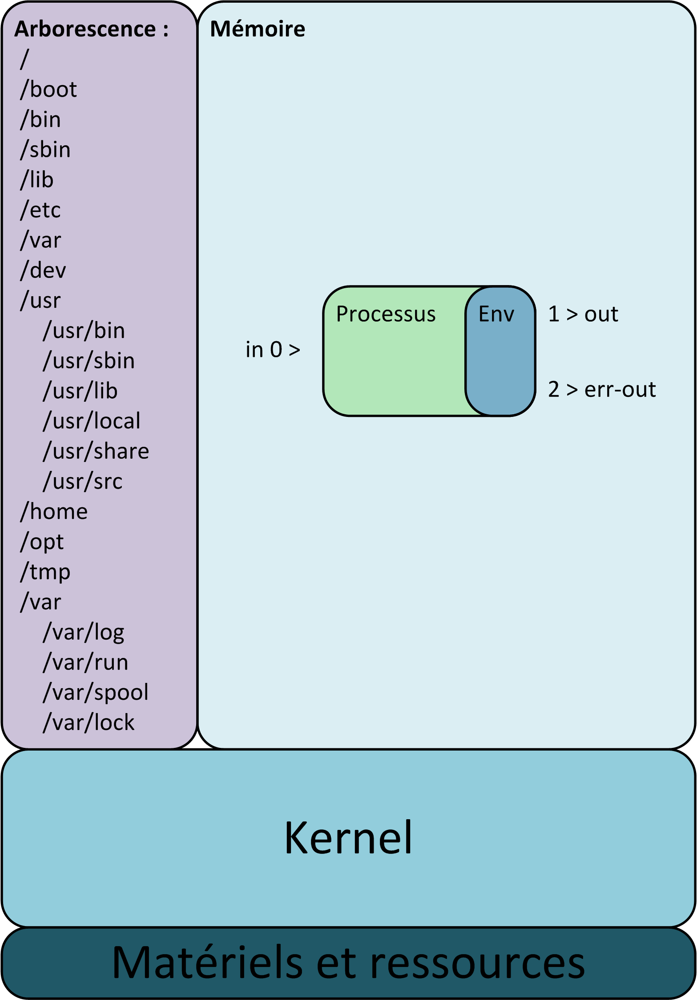

# GNU/Linux

Linux est le noyau de système d'exploitation open source le plus utilisé : **GNU/Linux**.
C'est un noyau Unix libre et exécutable sur les architectures x86 et x86_64 (entre autres) alors que les Unix étaient destinés aux ordinateurs professionels (powerPC, SPARCS, Z/system, etc...).

Tout comme GNU, il se base sur les spécifications d'Unix : la norme [POSIX](./normes.md#posix)

## Quelques principes

* Tout est fichier de l'arborescence
* Tout les fichiers et tout les processus sont associés à un compte utilisateur (et un groupe)
* Tout processus est le fils d'un autre processus (à part le premier : "Init", on en reparlera
* Une aproche modulaire [Faire une seule chose mais la faire bien (et complètement).](https://fr.wikipedia.org/wiki/Philosophie_d%27Unix)
* et enfin : **"UNIX was not designed to stop its users from doing stupid things, as that would also stop them from doing clever things."** En clair vous pouvez faire n'importe quoi quitte à tout casser.

## Un système Unix

### Sur la couche matérielle on retrouve

* un noyau qui s'exécute en permanence et qui gère la couche matérielle
* une [arborescence](./arborescence.md) unique contenant tout (on reviens dessus un peu plus tard)
* un ensemble d'outils dont le [shell](./shell.md), init et les commandes (on va en reparler du shell)

Le noyau c'est Linux, l'ensemble des outils de base est fourni par le projet GNU de RMS et l'arborescance correspond au standard [FHS](./normes.md#FHS)

> le système d'exploitation c'est "**GNU/Linux**" et pas seulement "**Linux**".

## Une distribution Linux

Une distribution est une suite logiciel comprenant un systèmes GNU/linux avec un ensemble d'application et d'outils **intégré** à celui-ci dont un outil facilitant l'installation du système et un permettant la gestion des logiciels intégrés (installation, désinstallation, mise à jour). La plupart ajoutent aussi de la documentation en ligne des forums d'échange et des dépôt de logiciel en ligne (open source ou non).

Elle est conçu par un éditeur logiciel qui intègre une version adapté et [compilé](./definitions.md#compilation) du noyau, des outils d'installation et de maintenance et tout un ensemble de logiciel libre ou non en général précompilé.

Les programmes étant compilés, ils ne sont disponibles que pour certaines architectures de processeurs (x86, x86_64, arm, ).

### Recensement

Il existe un grand nombre de distributions mais il y a 3 grandes familles historique qui ont eu plein d'enfants.

* Debian : la distribution libre de la **F**ree **S**oftware **F**ondation
* Slackware : la distribution "Unix like" (code source et  compilation)
* Redhat : la distribution orienté entreprise

On notera aussi :

* Ubuntu créé à partir de debian et trés orienté utilisateurs
* Suse qui à l'origine descendait de Slakeware et qui est trés utilisé dans le monde de l'entreprise,
* Gentoo qui recompile tout pour votre archi
* Arch qui ne produit pas de versions mais qui est en constante évolution (rolling update).

## Conclusion

Une distribution GNU/Linux est un assemblage de logiciels principalement opensource et/ou libre permettant l'installation et la gestion d'un système d'exploitation sur un ordinateur.

Je vous proprose maintenant de réaliser une première [installation ubuntu](TD-install-ubuntu.md)
