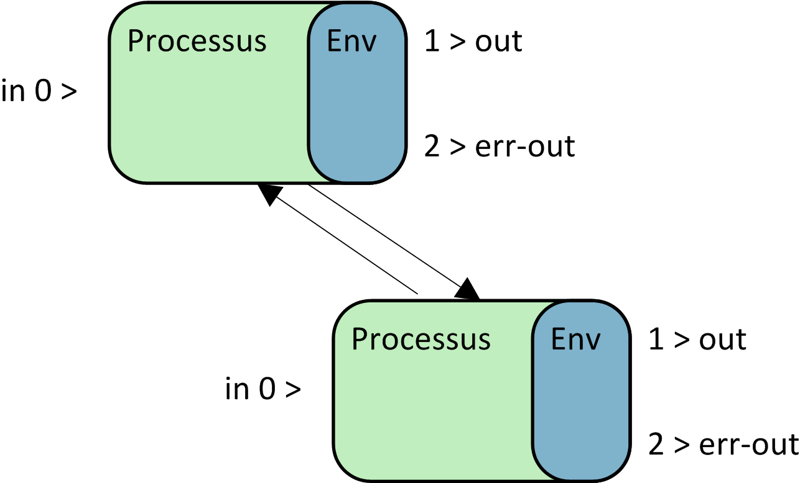

# Gestion des processus

## Présentation

Avec le principe **time sharing**, chaque processus va disposer de temp sur un coeur de CPU afin de s'exécuter.

Le Kernel ordonnance l'execution des processus:

* Processus kernel (les threads du kernel)
* Processus système (services ou daemon)
* Processus utilisateurs

Mis à part init chaque processus est initié par un autre processus (son père) par la fonction fork ([wikipedia:fork](https://fr.wikipedia.org/wiki/Fork_(programmation))) puis la fonction exec



Un [appel système](definitions.md#syscall) est fait (fork) pour créer un nouveau processus répliquant le premier.

Un second appel système est fait (exec) pour modifier le processus : le fichier exécutable et ses arguements sont remplacé par le résultat de l'interprétation de la commande.

Il est possible de visualiser l'arborescence de processus au travers de la commande `pstree`

Il est aussi possible d'afficher un instané des processus en cours d'exécution avec la commande `ps -ef`

```bash
prompt$ ps -ef | head -4
UID        PID  PPID  C STIME TTY          TIME CMD
root         1     0  0 mars03 ?       00:00:07 /sbin/init splash
root         2     0  0 mars03 ?       00:00:00 [kthreadd]
root         4     2  0 mars03 ?       00:00:00 [kworker/0:0H]
```

Ceci permet de consulter les principales caractéristiques des processus :

* Uid : L'utilisateur propriétaire du processus
* PID : L'id de processus
* PPID : L'id du processus père
* C : L'utilisation CPU
* Stime : start time
* TTY : le terminal de ratachement
* Time : le temps cpu consommé

Enfin La commande historique et interactive `top` offre une vision globale sur la charge du système, elle permet de voir evoluer la liste de processus et de les trier suivant plusieur critère. (h pour l'aide, q pour quitter)

```bash
top - 18:47:30 up 21 days,  6:44,  2 users,  load average: 0,54, 0,57, 0,70
Tasks: 234 total,   1 running, 174 sleeping,   0 stopped,   2 zombie
%Cpu(s):  5,1 us,  5,3 sy,  0,0 ni, 89,5 id,  0,0 wa,  0,0 hi,  0,0 si,  0,0 st
KiB Mem :  8052552 total,   432420 free,  6116840 used,  1503292 buff/cache
KiB Swap:  8270844 total,  7743300 free,   527544 used.  1512688 avail Mem

  PID USER      PR  NI    VIRT    RES    SHR S  %CPU %MEM     TIME+ COMMAND
 6136 alan      20   0 4094248 1,095g 1,032g S  15,4 14,3  14:09.52 VirtualBox
 3698 alan       9 -11  484288  14432  12156 S   6,1  0,2 188:03.38 pulseaudio
 4621 alan      20   0 3375136 673300  95284 S   4,9  8,4   1306:33 Web Content
 1367 root      20   0  872692 339640 102148 S   4,1  4,2 207:15.51 Xorg
 3920 alan      20   0 2715416 484748 124708 S   1,8  6,0 391:22.38 firefox
```

* l'uptime, `18:47:30 up 21 days,  6:44` la date suivi par l'age du dernier boot du système.
* Le nombre de session utilisateurs,
* le load average (une évaluation de la charge basé sur la moyenne nombre de processus en statut wait)
* Un statut global sur les processus
* La charge CPU puis Mémoire
* enfin la liste des processus en cours d'exécution.

### Statut

Du fait du partage du temps d'exécution et de la gestion des ressources par le kernel un processus peu avoir différent états :

* Running : en cours d'exécution (sur un cpu)
* Waiting : Processus en attente d'une ressource
* Stopped : Arrêté ([Ctrl] Z), en pause
* Swapped : idem waiting mais placé en [swap](./definitions.md#swap)
* *Zombie : processus terminé voulant fournir son code retour a son père (qui ne l'attend plus)*
* *Dying : en train d'écrire un fichier core (en cours de plantage)*

### Le code retour

À la fin de chaque exécution le processus retransmet à sont processus père un code illustrant le résultat de son exécution, le code retour.

Si le processus s'est **corectement exécuté, alors le code retour vaux 0**

En cas d'erreur ou d'échec le code retour contien un entier non nul (de 1 à 128) retournant le code erreur correspondant à l'erreur ou l'echec.

le code retour de la dernière commande passé est présent dans la variables spéciale du shell `$?`

```bash
prompt$ grep alan /etc/passwd
alan:x:1000:1000:alan,,,:/home/alan:/bin/bash
prompt$ echo $?
0
prompt$ grep raton-laveur /etc/passwd
prompt$ echo $?
1
prompt$ grep raton-laveur la-rivière
grep: la-rivière: No such file or directory
prompt$ echo $?
2
```

Ici, pour grep en cas :

* De succès (au moins une occurence trouvée), le code retour est 0
* D'échec (pas de ligne trouvée), le code retour est 1
* D'erreur pour abscence de fichier d'entrée, le code retour est 2

En cas de besoin, le man de chaque commande vous renseignera sur la signification des code retours. En général cela n'est pas nécessaire car le flux d'erreur est plutôt explicite.

### Environnement

Dans le Shell, en plus des variable d'[environnement](environment-Unix.md), il est possible de récupérer d'autres variables lié au processus courant et à l'arborescance de processus:

```bash
$ ps -f
UID        PID  PPID  C STIME TTY          TIME CMD
alan      8887 11820  0 15:55 pts/6    00:00:00 ps -f
alan     11820 18554  0 mars22 pts/6   00:00:00 /bin/bash
alan@al-e6230:~/prep-form/2018-2019/B1/linux1$ echo $?
0
alan@al-e6230:~/prep-form/2018-2019/B1/linux1$ echo $$
11820
alan@al-e6230:~/prep-form/2018-2019/B1/linux1$ echo $PPID
18554
alan@al-e6230:~/prep-form/2018-2019/B1/linux1$ echo $0
/bin/bash
```

* $? : le code retour de la dernière commande passée
* $$ : le pid du processus courant (ici c'est votre shell)
* $PPID : le pid du processus père de votre processus courant
* $0 : la commande utilisé pour lancer le processus courant
* $1,$2, ... $n : les différents arguments passé à cette commande (ici aucun)

### les signaux `kill`

Vous pouvez transmettre un signal afin d'initier une modification de comportement du processus.
C'est ce qu'il se passe lorsque vous tapper un [ctrl]c vous envoyer en fait le signal 2 ou `SIGINT`

On utilise la commande `kill` en précisant le SIGNAL a envoyer et le PID du processus concerné

Exemple SIGINT au processus de pid 8339  :

```bash
prompt$ kill -2 8339
```

La commande `man 7 kill` fournie les signaux existant.
Ceux de la normes [posix](./normes.md#Posix) sont les suivants :

```bash
       First the signals described in the original POSIX.1-1990 standard.

       Signal     Value     Action   Comment
       ──────────────────────────────────────────────────────────────────────
       SIGHUP        1       Term    Hangup detected on controlling terminal
                                     or death of controlling process
       SIGINT        2       Term    Interrupt from keyboard
       SIGQUIT       3       Core    Quit from keyboard
       SIGILL        4       Core    Illegal Instruction
       SIGABRT       6       Core    Abort signal from abort(3)
       SIGFPE        8       Core    Floating point exception
       SIGKILL       9       Term    Kill signal
       SIGSEGV      11       Core    Invalid memory reference
       SIGPIPE      13       Term    Broken pipe: write to pipe with no
                                     readers
       SIGALRM      14       Term    Timer signal from alarm(2)
       SIGTERM      15       Term    Termination signal
       SIGUSR1   30,10,16    Term    User-defined signal 1
       SIGUSR2   31,12,17    Term    User-defined signal 2
       SIGCHLD   20,17,18    Ign     Child stopped or terminated
       SIGCONT   19,18,25    Cont    Continue if stopped
       SIGSTOP   17,19,23    Stop    Stop process
       SIGTSTP   18,20,24    Stop    Stop typed at terminal
       SIGTTIN   21,21,26    Stop    Terminal input for background process
       SIGTTOU   22,22,27    Stop    Terminal output for background process

       The signals SIGKILL and SIGSTOP cannot be caught, blocked, or ignored.

```

C'est en général au processus de prendre en compte les signaux.

On notera les plus courant :

* `SIGTERM` , le signal par défaut qui demande au processus de s'arreter
* `SIGINT` , le signal de l'interruption clavier `[ctrl]c`
* `SIGHUP` , il est transmis à un processus pour lui signifier que sont terminal de rattachement ou que son processus père n'est plus disponible.
* `SIGPIPE` , il indique à un processus que le processus suivant récupérant ses donnée ne les lit plus et provoque en général son arret

Les deux signaux suivant sont en fait transmis au kernel et non pas au processus:

* `SIGSTOP` , le kernel met le processus en pause (Stopped)
* `SIGKILL` , le processus ne disposera plus du CPU il est tout simplement éffacé de la mémoire

**le kill -9 est a éviter** il est radical donc souvant cité mais c'est une erreur que de l'utiliser dans la plupart des cas. et puis c'est telement [triste](http://turnoff.us/image/en/dont-sigkill.png)

## Entrées sorties

### Principe

Toute commande, tout processus traite des données. Les données en entrée sont celle qui seront traitées. Les données en sortie sont le résultat du traitement. 
Sauf redirection, la sortie des commandes est transmise à l'écran du terminal de l'utilisateur.

Les données à traiter sont très souvant contenues dans le fichier passé en dernier argument de la ligne de commande. En l'absence de fichier d'entrée elles sont attendu sur l'entrée standard qui, sauf redirection, est le clavier du terminal de l'utilisateur

**Exemple un peu tordu :**
En lançant la commande grep toto sans fichier à traiter :

```bash
prompt$ grep toto

```

`grep` attends alors les lignes à traiter sur son entrée : le clavier du terminal.
Vous pouvez saisir alors plusieurs lignes de texte, elle s'affiche sur l'écran du terminal comme pour chaque saisie. Si l'une d'entre elle contien le mot toto grep l'affichera aussi sur le terminal et elle aparaitra alors 2 fois.

**Appuyez sur [ctrl]+c pour interrompre le grep.**

### Entrées

* Les Arguments : le texte saisie après la commande est une suite d'arguments, ils sont séparés par des espaces ou tabulations

* L'entrée standard : elle peu être
  * la lecture d'un fichier passé en paramètre
  * La saisie sur le terminal
  * Un flux de sortie d'une autre commande en utilisant le pipe `|`

### Sorties

Les sorties standard et d'erreur sont en général redirigées vers le terminal de l'utilisateur, il s'agit de deux flux de données distincts :

* Le flux standard : Ce que retourne la commande, le résultat du traitement
* Le flux d'erreur : Les messages d'erreurs lié à l'exécution

## Redirections des flux

### L'entrée standard

Le flux d'entrée est le flux numéro 0.

`cmd < fichier` : la commande lit son entrée standard dans le fichier file.

Dans un [script](./scripting.md) shell on peu redirigé du text vers l'entrée du commande avec `<<` jusqua un label :

```bash
prompt$ cat > fichier <<EOF
quelques lignes
cela veus dire au moins deux
EOF
$ cat fichier
quelques lignes
cela veus dire au moins deux
```

Ici le label choisi est EOF (on le choisi souvant pour End Of File).

Il n'est pas nécessaire de nommer le flux `0<` car c'est le flux d'entrée standard, si on redirige un flux d'entrée, par défaut c'est celui-ci.

### La sortie standard

Le flux de sortie standard est le flux numéro 1.

`cmd > fichier` redirige la sortie de la commande cmd vers le fichier fichier, il est créé s'il n'existe pas

```bash
prompt$ echo toto > sortie-std.txt
```

Il n'est pas non plus nécessaire de le nommer `1>` car c'est le flux de sortie standard, si on redirige un flux de sortie, par défaut c'est celui-ci.

### Le flux d'erreur

le flux d'erreur est le flux numéro 2.

`cmd 2> fichier` redirige les messages d'erreur vers le fichier fichier, il est créé s'il n'existe pas

```bash
cat truc 2> sortie-err.txt
```

Ici si le fichier "truc" est inexistant le message d'erreur est écrit dans le fichier sortie-err.txt

Cette fois ci, il est necessaire de le nommer par sont id de flux `2>`

**Atention**

* La redirection simple :  `>` écrase le contenu du fichier existant
* La redirection double : `>>` ajoute la sortie au contenu existant du fichier

### Le pipe `|`

Le caractère spécial `|` nommé pipe ou tube permet de chaîner des commandes sur le flux de données standard

Cela permet de filtrer la sortie **standard** d'une commande en la rediregeant vers l'entrée d'une autre commande. (voir les commande [filtres](./filtres.md))

### Redirection vers un autre flux

`2>&1` redirige le flux 2 erreur standard vers le flux 1 sortie standard, Ainsi il est possible de traiter les messages d'erreur dans le |

0 1 et 2 sont les descripteur de fichiers courants. Il est aussi possible des creer de nouveau descripteur de fichiers.

## Lancement

Il existe plusieurs façon de démarrer un processus depuis le shell. Nous l'avons vu précédament, chaque commande externe passée est un sous processus du shell. Cependant le shell attend la fin du sous processus pour reprendre la main sur l'entrée standard (pour la lecteur des commandes suivante).

### Enchainement de processus

#### Enchainement simple

le `;` permet de simuler une fin de ligne de commande et donc de lancer plusieurs commandes les unes à la suite des autres en une seule ligne :

```bash
prompt$ echo 1 ; echo 2
1
2
```

#### Lancer un sous shell

Il est possible de grouper des commandes dans un sous shell par exemple pour rediriger l'ensemble des sorties en une seule fois

```bash
prompt$ (echo attend 10 secondes ; sleep 10 ; echo voilà) > resultat
prompt$ cat resultat
attend 10 secondes
voilà
```

Les parenthèses groupes plusieurs commandes un second shell est lancé pour exécuter les commande une par une, la redirection est alors appliquée à ce shell.

#### Enchainement conditionnel

Il est possible d'enchainer une commande sous condition du résultat d'exécution de la première.

##### `&&` le ET logique

Si la première commande c'est bien passé le shell exécute la seconde :

```bash
prompt$ grep alan /etc/passwd && echo success
alan:x:1000:1000:alan,,,:/home/alan:/bin/bash
success
prompt$ grep rododindron /etc/passwd && echo success
prompt$ grep alan /etc/passemoilesel && echo success
grep: /etc/passemoilesel: No such file or directory
prompt$ echo $?
2
```

##### `||` le OU logique

si la première commande c'est mal passé, alors le shell exécute la seconde :

```bash
prompt$ grep un-canard /etc/passwd || echo il est pas là
il est pas là
```

##### expression tripartite

Il est alors possible de construire une ligne de commande intégrant trois actions les deux dernière étant exécuté en cas de succes ou d'échec de la première

```bash
prompt$ true && echo OK || echo KO
OK
prompt$ false && echo OK || echo KO
KO
```

### Taches en arrière plan

Il est possible de lancer un processus en arrière plan en ajoutant le caratère `&` en fin de ligne de commande. Il nous est alors possible de continuer à travailler sur le shell pendant son exécution.

```bash
prompt$ sleep 3000 &
[1] 6707
prompt$ ps
  PID TTY          TIME CMD
 6707 pts/6    00:00:00 sleep
 6708 pts/6    00:00:00 ps
11820 pts/6    00:00:00 bash
```

Le shell nous retourne la numéro de 'job' et le PID associé.
Le processus attend 3000 secondes en arrière plan. (Cela n'a aucun intérêt de faire cela certe, mais c'est pratique pour expliquer les taches en arrière plan.)

Attention, en l'absence de redirection, les sorties d'erreur et standard d'une commande passée en arrière plan restent attaché au terminal. Il conviendra dans certains cas, pour plus de clarté, d'utiliser les redirections de flux pour les orienter vers un fichiers plutot que vers le terminal.

```bash
prompt$ (echo attend 300 seconde ; sleep 300 ; echo voilà) > resultat &
[1] 8343
```

#### `jobs`

La commande interne `jobs` permet de lister les taches en arrière plan :

```bash
prompt$ type jobs
jobs is a shell builtin
prompt$ jobs
[1]+  Running                 ( echo attend 300 seconde; sleep 300; echo voilà ) > resultat &
```

Le petit `+` a coté du numéro de job `[1]` indique celui sélectioné par défaut.

#### `fg` pour ForGround

La commande interne `fg` permet de reprendre en avant plan une tache initialement lancé en arrière plan

**Mise en évidence :**

* Je lance 4 processus en arrière plan un par un (jutilise le rappel de commande avec la flèche vers le haut bien sur)
* je consulte les jobs
* je reprend en avant plan le second job avec la commande `fg 2`
* Je l'interomps avec un `[ctrl]c`
* je consulte alors les jobs restant

```bash
prompt$ sleep 30 &
[1] 8389
prompt$ sleep 30 &
[2] 8390
prompt$ sleep 30 &
[3] 8391
prompt$ sleep 30 &
[4] 8392
prompt$ jobs
[1]   Running                 sleep 30 &
[2]   Running                 sleep 30 &
[3]-  Running                 sleep 30 &
[4]+  Running                 sleep 30 &
prompt$ fg 2
sleep 30
^C
prompt$ jobs
[1]   Running                 sleep 30 &
[3]-  Running                 sleep 30 &
[4]+  Running                 sleep 30 &
```

#### `bg` pour BackGround

La commande interne `bg` permet de passer en arrière plan une commande, afin de pouvoir passer cette commande il faut au préalable "stopper" le processus avec la suite de commande `[ctrl]z`.

**Mise en évidence :**

* Je lance une suite de commandes groupée dans un sous shell en avant plan
* Je la met en pause (stopped) avec un `[ctrl]z`
* Je la relance alors avec la commande `bg`

```bash
prompt$ (sleep 30 ; echo voilà)
^Z
[1]+  Stopped                 ( sleep 30; echo voilà )
prompt$ jobs
[1]+  Stopped                 ( sleep 30; echo voilà )
prompt$ bg
[1]+ ( sleep 30; echo voilà ) &
prompt$ jobs
[1]+  Running                 ( sleep 30; echo voilà ) &
prompt$ voilà
```

#### `wait`

Cette commande permet d'attendre que tout les traitement lancer en arrière plan soient terminer.

l'utilisateur perd la main sur le shell jusqua ce que tout les sous processus aient fini leur traitement.

## `/proc` le procfs

Sous GNU/linux les méta-données maintenues par le Kernel liées aux processus sont consultable dans la sous arborescence `/proc`.

Ici je consulte la commande qui à lancée le processus (exe), sont dossier courant(cwd) et ces descripteur de fichier (ld/*) ouverts. (j'utilise `$$` dans la commande cela sera remplacé par mon pid courant lors de l'interpretation de celle-ci)

```bash
prompt$ ls -al /proc/$$/exe /proc/$$/cwd /proc/$$/fd
lrwxrwxrwx 1 alan alan 0 mars  24 09:23 /proc/11820/cwd -> /home/alan/form/B1/linux1
lrwxrwxrwx 1 alan alan 0 mars  24 16:02 /proc/11820/exe -> /bin/bash

/proc/11820/fd:
total 0
dr-x------ 2 alan alan  0 mars  24 09:23 .
dr-xr-xr-x 9 alan alan  0 mars  22 17:26 ..
lrwx------ 1 alan alan 64 mars  24 09:23 0 -> /dev/pts/6
lrwx------ 1 alan alan 64 mars  24 09:23 1 -> /dev/pts/6
lrwx------ 1 alan alan 64 mars  24 09:23 2 -> /dev/pts/6
lrwx------ 1 alan alan 64 mars  24 09:23 255 -> /dev/pts/6
```

## `nohup`

`nohup` est une commande qui exécute la ligne de commande passée en paramètre en fermant son entrée standard et qui force la redirection des sortis vers le fichier ./nohup.out si elle n'est pas déjà redirigé.

Elle est utilisée afin de détacher un processus de son processus père. Elle permet en outre de modifier le comportement du signall sighup et ainsi de laisser un processus lancé de cette façon survivre après la mort de son père.

Je lance un sous shell au shell courant

```bash
prompt$ bash
prompt$ ps -f
UID        PID  PPID  C STIME TTY          TIME CMD
alan      9483 11820  0 16:38 pts/6    00:00:00 bash
alan      9498  9483  0 16:39 pts/6    00:00:00 ps -f
alan     11820 18554  0 mars22 pts/6   00:00:00 /bin/bash
prompt$ echo $$
9483
prompt$ pstree -s $$
systemd───lightdm───lightdm───upstart───/usr/bin/x-term───bash───bash───pstree
```

Je travail donc maintenant dans le shell de PID 9483
Je lance une commande avec la commande nohup :

```bash
prompt$ nohup sleep 300 &
[1] 9597
nohup: ignoring input and appending output to 'nohup.out'
prompt$ ps -f
UID        PID  PPID  C STIME TTY          TIME CMD
alan      9483 11820  0 16:38 pts/6    00:00:00 bash
alan      9597  9483  0 16:45 pts/6    00:00:00 sleep 300
alan      9599  9483  0 16:45 pts/6    00:00:00 ps -f
alan     11820 18554  0 mars22 pts/6   00:00:00 /bin/bash
```

Les "FileDescriptors" ont bien été modifiés, l'entrée c'est/dev/null et les sortie vont bien vers le fichier nohup.out

>Notez : `/dev/null` : c'est un périférique spécial sous unix qui est un fichier qui renvois rien et peu tout absorber, un puits sans fond.

```bash
$ ls -al /proc/$!/fd
total 0
dr-x------ 2 alan alan  0 mars  24 16:45 .
dr-xr-xr-x 9 alan alan  0 mars  24 16:45 ..
l-wx------ 1 alan alan 64 mars  24 16:46 0 -> /dev/null
l-wx------ 1 alan alan 64 mars  24 16:46 1 -> /home/alan/form/B1/linux1/nohup.out
l-wx------ 1 alan alan 64 mars  24 16:45 2 -> /home/alan/form/B1/linux1/nohup.out
```

Je ferme le shell courant donc le père de la commande anssi lancée :

```bash
prompt$ exit
exit
prompt$ ps -ef | grep sleep | grep -v grep
alan      9597  3353  0 16:45 pts/6    00:00:00 sleep 300
$ pstree -s 9597
systemd───lightdm───lightdm───upstart───sleep
```

Le pére du processus sleep à été modifié et est remonté jusque upstart le pére de ma session graphique.
