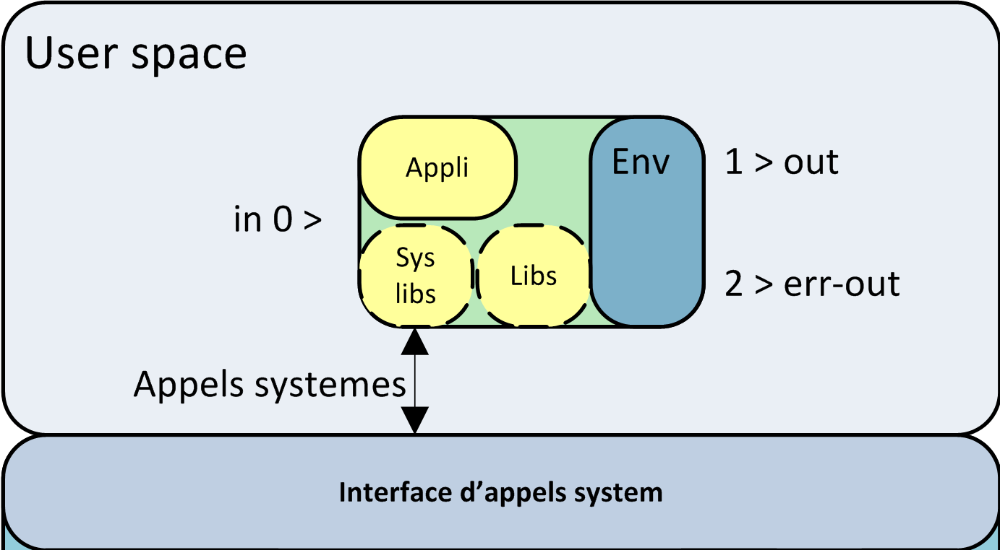

# Bibliothèques partagées

## Présentation

Une grande partie des fonctions exécutés par les commandes et logiciels utilisée sous linux sont identique d'un programme à l'autre, par exemple l'ouverture d'un fichier, la lecture sur l'entrée standard, la gestion des arguments de commandes, ou les algorythmes de compressions etc... Ainsi il n'est pas nécessaire de répèter ces fonctions dans chaque programme. Celle-ci sont compilés et disponible dans des bibliothèques partagés.

Une bibliothèque partagé est un exécutable qui ne dispose pas de fonction "main" : de fonctions d'exécution.

A l'exécution d'une commande, le kernel recherche les bibliothèques paratgées necessaire dans son cache et si absent dans /lib, /usr/lib et dans les dossiers pointé par la variable $LD_LIBRARY_PATH. Ces bibliothèques sont chargées en mémoire leurs API sont alors disponible pour tout les exécutable qui les solicite au travers du kernel et donc bien sur pour la commande initialement lancée.

Ainsi chaque programe peu être vue comme cela :


Nous pouvons distinguer les bibliothèques système qui contiennent les fonctions d'apels système et les autres bibliothèques qui offrent simplement des fonctionalités exemple la bibliothèque `zlib` qui contiens des fonction de compression de données.

## Gestion du cache

La commande `ldconfig` (à passer en tant que  root) permet de mettre à jour le cache de bibliothèques systèmes et les liens syboliques vers les bibliothèques.

Fichiers : /etc/ld.so.cache (donnée binaire), /etc/ld.so.conf : configuration du cache, /etc/ld.so.conf.d/* configuration du cache déposé par les packets

La commande ldd inspecte les liaisons sur les programmes exécutables et liste les bibliothèques utilisées par celui-ci ainsi que leurs adresses mémoires, là où celles-ci sont situées pour cet exécutable.

```bash
$ ldd /bin/ls
linux-vdso.so.1 =>  (0x00007ffea7dea000)
libselinux.so.1 => /lib64/libselinux.so.1 (0x00007f97e0238000)
libcap.so.2 => /lib64/libcap.so.2 (0x00007f97e0033000)
libacl.so.1 => /lib64/libacl.so.1 (0x00007f97dfe2a000)
libc.so.6 => /lib64/libc.so.6 (0x00007f97dfa5d000)
libpcre.so.1 => /lib64/libpcre.so.1 (0x00007f97df7fb000)
libdl.so.2 => /lib64/libdl.so.2 (0x00007f97df5f7000)
/lib64/ld-linux-x86-64.so.2 (0x00007f97e045f000)
libattr.so.1 => /lib64/libattr.so.1 (0x00007f97df3f2000)
libpthread.so.0 => /lib64/libpthread.so.0 (0x00007f97df1d6000)
```
