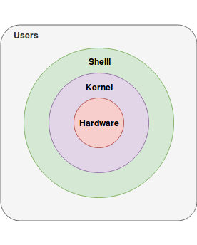
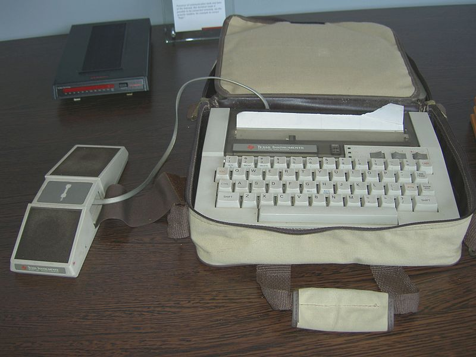

# Les shells Unix

## Présentation

Le shell : la "coquille" logicielle. C'est un interpréteur de commande permettant à l'utilisateur de faire des actions sur la machine ce sera principalement  **lancer une application**, **gérer des fichiers** et **configurer le système**.

Le shell est la première interface utilisateur sur les systèmes Unix, on peut dire que c'est la partie *homme* de l'interface **homme machine** la partie machine de l'interface étant le *kernel*.



Le shell est aussi un langage de programmation **interprété** :

* l'utilisateur saisit une commande, 
* celle-ci est lue, interprétée et enfin exécutée par le shell

[wikipedia:shell unix](https://fr.wikipedia.org/wiki/Shell_Unix)  
[wikipedia:l'interface homme machine](https://fr.wikipedia.org/wiki/Interface_syst%C3%A8me)

## Recencement

Il existe plusieurs shells, les plus utilisés sont les suivants :

* Le plus léger, le plus compatible, le shell historique : le bourne shell `/bin/sh`
* Le `csh` puis le `tcsh` ont ajouté quelques fonctionnalités comme la recherche dans l'historique des commandes (créé par Bill Joy)
* Le `ksh` est très courant sur les systèmes Unix propriétaires
* Le plus courant sous Linux est le `bash` (*bourne again shell*) il est issu du projet GNU, il regroupe les fonctionalités offertes par le `sh`, `csh` et le `ksh` et en apporte de nouvelles comme la complétion des commandes et des chemins.
* Plus récent le `zsh` offre des fonctionnalités supplémentaires comme la complétion des chemins sur des arborescences distantes (un autre host)

Le fichier système **`/etc/shells`** liste les shells reconnus comme valide sur le système.

## Le terminal

Un terminal est un périphérique d'entrée sortie ; un clavier fournit l'entrée et un écran la sortie.

Historiquement c'était un clavier et un écran directement relié à l'ordinateur via un câble rs-232 ou au travers d'un modem accoustique pour les plus moderne:
 GFDL & CC-by-2.5 Author : Mikaël Restoux
*à l'époque c'était moderne!*

Aujourd'hui c'est plutôt :

* soit une application graphique des systèmes unix disposant d'une interface graphique ;
* soit une application sur un poste de travail offrant un accès distant via le réseau à une machine Unix (connexion SSH).

## Principe d'une session shell

Dans le modèle client/serveur, c'est-à-dire sans environnment graphique, l'utilisateur se connecte sur une machine Unix avec un terminal.
1. sur le terminal s'affiche le mot `login:`
2. l'utilisateur saisit son compte utilisateur
3. le terminal affiche `password:`
4. l'utilisateur saisi son mot de passe. 

Une fois le mot de passe validé, une session est alors ouverte pour l'utilisateur : 
Un shell est lancé avec l'identité de l'utilisateur, son entrée est le clavier du terminal, sa sortie est l'écran.

Dans un environement graphique, la session utilisateur est géré au lancement de l'environnement, l'utilisateur lance une application *terminal* ou *console* qui fait partie de la session graphique. Il n'est pas nécessaire de se connecter, en revanche le résultat est identique. Un shell est lancé avec l'identité de l'utilisateur, son entrée est le clavier du terminal lorsque cette fenêtre est sélectionnée dans l'environnement graphique, sa sortie est la fenêtre terminal.

### Le prompt

```(bash)
alan@al-e6230:~/linux1$
```

Appelé aussi *l'invite de commande*, le prompt par défaut vous founit quelques informations importantes :

*'qui-vous-êtes'***@**'sur-quel-host'**:**/dans/quel/dossier/**$**

* J'imagine que vous savez déjà qui vous êtes ; le prompt vous renseigne sur votre **identité** Unix.
* Nous pouvons parfois *rebondir* d'un host à un autre, il est donc important de savoir sur quelle machine on se situe.
* Enfin le répertoire courant vous précise où vous vous situez sur cet host

### L'environnement

Unix permet d'isoler chaque processus dans un contexte d'exécution qui lui est propre. 
Le compte utilisateur courant, le répertoire courant, ainsi qu'un grand nombre d’éléments supplémentaire (que nous détaillerons plus loin) constituent l'environnement d'exécution ou le contexte d'exécution du shell.

### La ligne de commande

La ligne de commande, ce que saisi l'utilisateur, est composé de la commande potentiellement suivi par des options et arguments. (les *options* sont des arguments spécifiques placés en général juste après la commande).
L'espace " " entre la commande et chaque argument est le séparateur des champs de la ligne de commande. Lorsqu'un argument (exemple un nom de fichier) contient un espace, celui-ci doit être protégé par un anti-slash *\\* ou des quotes simples *'* ou doubles *"* afin que le shell ne l'interprète pas comme 2 arguments différents

```(bash)
Prompt$ Commande Argument\ 1 'Argument 2' "Argument 3"
```

Exemple de commande :

```(bash)
alan@al-e6230:~/form/linux1$ ls . images
.:
arborescence.md  first-install.md  images     Presentation_Linux.md  shell.md
definitions.md   historique.md     normes.md  README.md

images:
shell-unix.png                     vb-12.png  vb-17.png  vb-21.png  vb-26.png  vb-30.png  vb-7.png
system-unix.png                    vb-13.png  vb-18.png  vb-22.png  vb-27.png  vb-3.png   vb-8.png
Terminal_TI_Silent_Writer_700.JPG  vb-14.png  vb-19.png  vb-23.png  vb-28.png  vb-4.png   vb-9.png
vb-10.png                          vb-15.png  vb-1.png   vb-24.png  vb-29.png  vb-5.png
vb-11.png                          vb-16.png  vb-20.png  vb-25.png  vb-2.png   vb-6.png
```

La commande est **ls**, on lui a passé 2 arguments : **.** et **images** représentant respectivement le dossier courant et le dossier images.
Le shell nous retourne alors la liste des fichiers du dossier courant et du dossier images

#### Types de commande

Il existe deux types de commandes.

##### Les commandes internes

Ces commandes sont directement traitées par le shell, elles permettent:
* De gèrer l'environnement courant du shell ( **cd**, **env**, **pwd** ... );
* De contrôler l'exécution du shell ( sortir du shell **exit** , lancer une boucle **for** , gestion des conditions **if** etc.. );
* De modifier le comportement du shell ( mode debug : **set -x** , changer l'éditeur de la ligne de commande **set -o vi** ).

La commande help fournit une aide en ligne succincte pour les commandes internes du shell :

```
alan@al-e6230:~/form/linux1$ help help
help: help [-dms] [pattern ...]
    Display information about builtin commands.
    
    Displays brief summaries of builtin commands.  If PATTERN is
    specified, gives detailed help on all commands matching PATTERN,
    otherwise the list of help topics is printed.
    
    Options:
      -d	output short description for each topic
      -m	display usage in pseudo-manpage format
      -s	output only a short usage synopsis for each topic matching
    	PATTERN
    
    Arguments:
      PATTERN	Pattern specifiying a help topic
    
    Exit Status:
    Returns success unless PATTERN is not found or an invalid option is given.
```

##### Les commandes externes

Ce sont en fait des programmes, lancés par le shell et qui effectue une action (**mv** pour déplacer des fichiers, **cp** pour copier des fichier, etc...). Une fois l'action réalisée, le programme se termine et l'utilisateur revient alors sur le shell.

Exemple:
```bash
alan@al-e6230:~/form/linux1$ sleep 4
```

Ce programme attend simplement 4 secondes.

Les commandes externes disposent d'un manuel d'utilisation : le [man](./man.md) 

# Conclusion

Le shell est un programme fournissant une interface homme-machine pour gérer les fichiers, le système d'exploitation et pour lancer des applications ou programmes.

Le standard sous linux est le bash.

Pour pouvoir utiliser pleinement la ligne de commande, il faut comprendre [l'arborescence](./arborescence.md) de fichiers sous unix.

La mîitrise du shell est fortement lié à la maîtrise des [principales commandes](./commands.md) du shell, **il faut les connaitre et savoir lire le man.**
