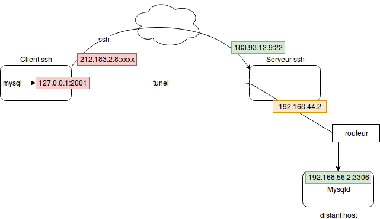

# ssh

## Présentation

ssh est un protole client serveur offrant un grand nombre de fonctionalité la principale est l'accès distant et sécurisé à un systeme unix ou gnu/linux. Il permet aussi d'effectuer des copies de fichier d'une serveur vers un autre (commande scp) ou de faire du tunneling de flux réseaux TCP (un low cost vpn) le tout au travers d'un flux chiffré de données.

Il repose sur une connexion TCP du client vers le port 22 du serveur.

Il apporte un niveau de sécurité suplémentaire en chiffrant les données qui transitent sur le réseaux, en permettant de se connecter avec une clef privée plutot qu'avec un mot de passe et identifiant les hotes sur lesquels on se connecte.

## Utilisation

### Commandes Principales

* `ssh user@host` : Permet de se connecter sur host avec le compte user  
* `scp fichier user@host:/chemin/vers/le/dossier` : copie le fichier sur le host dans le dossier nommé avec les droits du user  
* `ssh-keygen` : permet de génrer une nouvelle pair de clef publique/privée pour le compte courant  
* `ssh-copy-id user@host` : gère le dépot de la clef publique sur le host sur home du user  
* `ssh -L 2001:192.168.56.2:3306 user@Serveur-ssh` : conexion en tant que user sur host en activant le forward du port local-port vers le socket tcp 192.168.56.2:3306  


L'utilisation de l'option -vvv sur les commandes ssh permet de disposer d'un log trés verbeux permettant alors d'analyser les problèmes de connexion.

### Authentification par clef

Principe de chiffrement asymétrique : L'utilisateur dispose d'une clef privé et d'une clef publique. Ce qui est chiffré avec une clef est déchiffrable par l'autre.
La clef dite publique est diffusé largement alors que la clef privée reste secrète (et est en général protègé par un mot de passe)

L'authentification par clef consiste à déposer sa clef publique dans le fichier `~/.ssh/authorized_keys` de l'utilisateur cible. A l'authentification un chalenge de déchiffrement permet au client ssh de prouver que l'utilisateur possède bien la clef privée associée à cette clef publique. Les droits vers se fichier doivent être précis.

### Configuration client

Le fichier `~/.ssh/config` permet de définir des paramètres spécifiques par host.

Exemple :

```bash
Host serveur
 HostName 192.168.56.99
 User Alan
 Port 22
 IdentityFile ~/.ssh/.id_rsa
```

Le fichier `~/.ssh/known_hosts` conserve les clef publiques des **hote** sur lesquels nous nous somme déja connecté.

* A la première connexion ssh vous demande de valider l'hote sur lequel vous vous connecter :

  ```bash
  $ ssh root@192.168.56.101The authenticity of host '192.168.56.101 (192.168.56.101)' can't be established.
  ECDSA key fingerprint is SHA256:sCZkgGfozArBgm/ObjDt4LP4PN4/ksO9JCLtVokwwxA.
  Are you sure you want to continue connecting (yes/no)? yes
  Warning: Permanently added '192.168.56.101' (ECDSA) to the list of known hosts.
  ```

* à chaque re-connexion cette clef est vérifié afin de s'asurer que personnes ne cherche à se faire passer pour l'hote sur lequel on essaye de se connecter. Il peu être necessaire de supprimer certaine entrée dans ce fichier afin de prendre en compte le changement de clef coté serveur.
exemple :

  ```bash
   $ ssh root@192.168.56.101
  @@@@@@@@@@@@@@@@@@@@@@@@@@@@@@@@@@@@@@@@@@@@@@@@@@@@@@@@@@@
  @    WARNING: REMOTE HOST IDENTIFICATION HAS CHANGED!     @
  @@@@@@@@@@@@@@@@@@@@@@@@@@@@@@@@@@@@@@@@@@@@@@@@@@@@@@@@@@@
  IT IS POSSIBLE THAT SOMEONE IS DOING SOMETHING NASTY!
  Someone could be eavesdropping on you right now (man-in-the-middle attack)!
  It is also possible that a host key has just been changed.
  The fingerprint for the ECDSA key sent by the remote host is
  SHA256:sCZkgGfozArBgm/ObjDt4LP4PN4/ksO9JCLtVokwwxA.
  Please contact your system administrator.
  Add correct host key in /home/alan/.ssh/known_hosts to get rid of this message.
  Offending ECDSA key in /home/alan/.ssh/known_hosts:12
    remove with:
    ssh-keygen -f "/home/alan/.ssh/known_hosts" -R 192.168.56.101
  ECDSA host key for 192.168.56.101 has changed and you have requested strict checking.
  Host key verification failed.
  ```

  On supprime alors la ligne 8 du fichier ou on renonce à se connecter.  

### L'agent 'ssh-agent'

Le processus ssh-agent garde en cache les passphrase des clef privée afin de ne pas avoir à les ressaisir à chaque utilisation

Utilisation :
On lance un sous processus bash qui porte un sous processus ssh agent. Puis on ajoute des clefs privé dans l'agent. les processus associé à ssh pourront alors demander à l'agent de valider les chalenge d'authentifications

```bash
prompt$ ssh-agent bash
prompt$ ssh-add ~/.ssh/id_rsa_gitlab
Enter passphrase for /home/alan/.ssh/id_rsa_gitlab:
Identity added: /home/alan/.ssh/id_rsa_gitlab (/home/alan/.ssh/id_rsa_gitlab)
prompt$ ps
  PID TTY          TIME CMD
 1761 pts/7    00:00:00 bash
17534 pts/7    00:00:00 bash
17636 pts/7    00:00:00 ps
prompt$ pstree 1761
bash───bash─┬─pstree
            └─ssh-agent
prompt$ echo $SSH_AGENT_PID
17535
```
